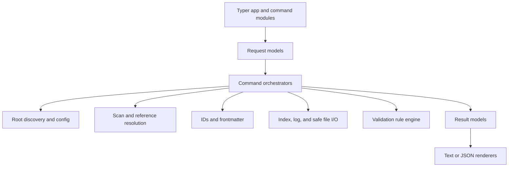

# Current Implementation Summary

**As of:** 2026-07-22

## Project overview

This project is building `kb`, a deterministic Python CLI for maintaining a Git-backed knowledge base made of Markdown documents with YAML frontmatter. The intended product eventually combines:

- A deterministic CLI for storage, querying, validation, graph operations, and housekeeping.
- Agent skills that provide judgment-heavy workflows such as reconciliation, authoring, and semantic linting.

Only the CLI foundation is currently being built. There is no skill layer in this repository yet.

The current implementation is a strong foundation for adding read-only query and graph commands. PRD v0.5 alignment has landed, including the charter, `links`, `pending_upstream`, and `link_types`.

## What is actually implemented

The current verification suite passes:

```text
698 passed in 18.29s (`uv run pytest -q`)
```

The status refresh commit leaves two pre-existing untracked documentation files in the worktree; they are unrelated and were not modified.

| Command | Current status |
|---|---|
| `kb init` | Fully implemented against AC1–AC30 |
| `kb create` | Fully implemented against AC1–AC52 |
| `kb validate` | Fully implemented against AC1–AC82 |
| `kb ingest` | Fully implemented against AC1–AC50 |
| `kb revise` | Fully implemented against `kb-revise.md` AC01–AC43 |
| Query commands | Designed, not implemented |
| Graph commands | Designed, not implemented |
| `kb mv` | Designed, not implemented |
| Standalone `kb index` / `kb log` | Helpers exist, commands do not |
| Agent skills | Out of scope for this repository so far |

The five registered commands are visible in `src/kb/cli/app.py`.

## Current architecture

The intended architecture is “pure core library plus a thin Typer shell.” In practice, it is more precisely a UI/core split: the core contains domain rules and filesystem/process infrastructure, while the CLI handles argument parsing, rendering, and exit behavior.



### CLI layer

`src/kb/cli/` contains:

- `app.py`: registers commands.
- One command module per command: parses Typer arguments, builds a Pydantic request, calls the core function, translates failures into exit codes, and renders the result.
- `render.py`: centralized plain-text, JSON, and error rendering.

The command modules are genuinely thin. They contain little domain logic beyond CLI-owned external input acquisition, validation stdin handling, and warning routing.

### Core layer

`src/kb/core/` currently divides into:

- `model.py`: shared document, configuration, and frontmatter models.
- `scan.py`: root discovery, frontmatter parsing, classification, scanning, and reference resolution.
- `ids.py`: numeric ID parsing, formatting, ordering, and allocation.
- `frontmatter.py`: YAML-safe rendering and lossless scalar updates.
- `indexing.py`: index rendering and directory-list regeneration.
- `safeio.py`: symlink-resistant and identity-checked file mutation.
- `housekeeping.py`: scaffold constants, initialization, timestamps, and log writing.
- `ingest.py`: deterministic raw-document creation from explicit adapter payloads.
- `create.py`: synthetic-document creation and supersession.
- `revise.py`: prepared synthetic revision, reference identity binding, and execution.
- `write_pipeline.py`: shared scan/config/write preparation for create, ingest, and revise.
- `validate.py`: all mechanical integrity rules and graph-cycle detection.

The core contains no Typer calls, printing, `sys.exit`, process-global standard-stream access, or subprocess launching, so the important CLI/core boundary is respected. It is not “pure” in the functional sense because core modules perform KB filesystem I/O. External files, stdin, and clipboard acquisition are CLI-owned adapters that pass explicit bytes and provenance into core workflows.

## Implemented command behavior

### `kb init`

`init_kb()` in `core/housekeeping.py`:

- Resolves or creates the target root.
- Builds the fixed thirteen-file scaffold.
- Creates eight CLI-owned `index.md` files.
- Creates three protected governance documents: `charter.md`, `conventions.md`, and the human-readable `kb-config.md` reference.
- Creates `kb-config.json` and append-only `log.md`.
- Is safely repeatable.
- With `--force`, restores only CLI-owned config and index files.
- Rejects symlinks, junctions, and wrong-kind manifest paths.
- Never invokes Git.

Initialization is not transactional: an OS failure may leave a partial scaffold, as the spec explicitly permits.

### `kb ingest`

`ingest()` in `core/ingest.py` supports:

- File, stdin, and clipboard byte acquisition through an adapter registry.
- UTF-8 text normalization.
- Raw source, chat, and feedback classification.
- Feedback `about` reference canonicalization.
- Configurable max+1 IDs.
- Deterministic slug and title generation with basic collision handling.
- Raw frontmatter emission.
- Byte-identical storage with a citable Markdown stub for non-UTF-8 files.
- Nested destination subdirectories and their indexes via `--dest`.
- Target index regeneration.
- Log append.

### `kb create`

`create()` in `core/create.py` is the most complete write workflow:

- Discovers the root, loads config, and scans once.
- Refuses allocation when malformed files exist.
- Resolves and canonicalizes parent references.
- Requires at least one parent.
- Allocates the next configured synthetic ID.
- Emits frontmatter in pinned key order.
- Supports body files or stdin, with newline normalization.
- Creates nested destination indexes bottom-up.
- Warns about undeclared types, tags, and long descriptions.
- Supports same-operation supersession.
- Updates only the affected index and log.

Supersession uses the lossless editor in `core/frontmatter.py` to change only `status`, `timestamp`, and `last_human_touch`, preserving unknown keys, ordering, YAML style, body bytes, and other frontmatter.

The mutable-file primitives in `core/safeio.py` protect against symlink substitution and file-identity races.

### `kb validate`

`validate()` in `core/validate.py` is a total, read-only integrity checker:

1. Discover the root and load configuration.
2. Scan the entire Markdown universe.
3. Compute every finding globally.
4. Resolve any requested scope.
5. Filter findings by their anchoring path.
6. Apply error, warning, and strict-mode exit rules.

It enumerates the stable finding-code source of truth covering:

- Unparseable frontmatter and missing `type`.
- Type and location agreement.
- Required fields, field shapes, and forbidden keys.
- Long descriptions and undeclared vocabularies.
- Canonical IDs, configured prefixes, and duplicate IDs.
- Unresolved provenance, associative-link, and pending-upstream relationships.
- Missing parents and chat-session parentage.
- Derivation cycles.
- Supersession and status coupling.
- Timestamp ordering.

Cycle detection uses an iterative strongly connected component algorithm, avoiding recursion-depth problems for large graphs.

Validation deliberately does not check semantic contradictions, stale content, orphan quality, index freshness, or whether a relationship is conceptually appropriate.

## Foundational data models

The main shared models are in `core/model.py`.

### Classification

- `DocClass`: `RAW`, `SYNTHETIC`, `GOVERNANCE`, `INDEX`, `OPERATIONAL`.
- `RawClass`: `SOURCE`, `CHAT`, `FEEDBACK`.

Classification derives exclusively from the frontmatter `type`, through `doc_class_from_type()`. Paths are validated against classification but never determine it.

### Frontmatter

- `Frontmatter`: ordered generic mapping preserving unknown keys.
- `RawFrontmatter`: writer-facing raw schema.
- `SyntheticFrontmatter`: full synthetic write schema.
- `GovernanceFrontmatter`: governance schema.
- `IndexFrontmatter`: generated-index schema.
- `OperationalFrontmatter`: root log schema (`type: log`).

All typed frontmatter models allow unknown extension fields. One subtle distinction is that writer models can be stricter than universal validation: for example, `RawFrontmatter` requires a `title` because ingest always emits one, while `kb validate` does not consider raw `title` universally mandatory.

### Documents and scans

`Document` contains:

- Canonical ID for an id-bearing raw, synthetic, or governance class; otherwise `None`.
- KB-relative path.
- Derived document class.
- Generic ordered frontmatter.
- A lazy `body` property that reads content only when accessed.

`KB` and `ScannedMarkdown` live in `core/scan.py`:

- `KB.files`: every discovered Markdown file, including malformed and operational files.
- `KB.documents`: every classifiable document, including index and operational documents.
- `KB.by_id`: in-memory lookup containing only canonical identities from id-bearing classes.
- `KB.malformed`: paths and parse or classification errors.
- `KB.root`: resolved root.

This dual representation is important: query commands can operate on valid documents, while validation retains the complete file universe.

### IDs and configuration

`DocId` models numeric IDs, with parsing, formatting, and ordering. `next_id()` calculates max+1 over the current scan.

`Config` models `kb-config.json`:

- Schema version.
- Type, tag, and associative `link_types` vocabularies.
- Per-class ID prefixes.
- Propagation-safe categories.

The config file is both configuration and root marker. Unknown configuration keys are ignored.

### Operational models

- `LogEntry`: structured append-only history event.
- `Finding`: stable validation result with code, severity, path, optional ID, and message.
- Per-command `Request`, `Result`, and typed failure classes.

## Key technical decisions

The most consequential decisions are:

- Markdown plus YAML frontmatter is the source of truth; there is no database.
- Every invocation rescans the KB; there is no persistent index or cache.
- `type` is mandatory and authoritative.
- IDs are sequential max+1 per configurable prefix.
- Governance documents use stable slug IDs.
- Malformed files block ID-allocation commands.
- Every directory must contain a CLI-owned `index.md`.
- `log.md` is operational and append-only.
- Unknown frontmatter keys are preserved.
- Bodies are loaded lazily.
- Skills must use CLI read and write paths rather than manipulating documents directly.
- Mechanical checks belong in the CLI; semantic judgment belongs in skills.
- Exit codes are consistently `0` success, `1` findings or reference failures, and `2` usage or environment failures.
- Every command supports stable JSON envelopes.
- The CLI never runs Git.
- Preflight failures are byte-atomic, but multi-file writes are not filesystem transactions; OS errors may leave partial state.
- Dependencies are intentionally limited to Typer, PyYAML, and Pydantic.

## Structural assessment

The code is well structured enough to add the first query and graph commands without a major rewrite.

The strongest reusable foundations are:

- Root and configuration discovery.
- The one-scan `KB` representation.
- Lazy body access.
- Canonical reference resolution.
- ID allocation.
- Deterministic rendering conventions.
- Index and log primitives.
- Lossless frontmatter editing.
- Comprehensive validation and acceptance tests.

There are, however, several emerging pressure points:

1. `validate.py` is already large. It is internally decomposed, but future rule growth would benefit from rule-family modules or a declarative schema-policy layer.
2. Schema information exists both in Pydantic models and validation tables. This duplication is currently necessary for exhaustive, non-cascading findings, but it creates drift risk.
3. `housekeeping.py` combines scaffold templates, initialization, timestamps, and logging. Adding public `kb index` and `kb log` commands will likely justify splitting scaffold and log responsibilities.
4. `render.py` imports every command result type. This is manageable now but makes every new command modify a central module.

## How much trajectory flexibility remains?

A great deal. This is still early: there are five public commands, and the repository rules explicitly leave the internal structure of `core/` and `cli/` flexible.

Low-risk additions include:

- `show` (including its frontmatter/path projections) and `filter`.
- Basic search using lazy bodies.
- Parent and child graph queries using `KB.by_id`.
- Standalone log append.
- Recursive index regeneration.

Medium-risk additions include:

- `kb index --check`.
- `kb links --transitive` and `--depth`.
- `kb mv`.
- Additional mutation commands built on the shared write pipeline.

Trajectory-changing decisions include:

- Introducing a database or persistent index.
- Replacing sequential IDs.
- Making paths authoritative instead of `type`.
- Changing the directory layout.
- Removing mandatory `type`.
- Changing existing JSON fields or validation-code semantics.
- Supporting cross-KB references.
- Adding true transactional multi-file updates.

Those larger changes are still technically feasible, but they would require coordinated changes to the normative specs, schema version, validators, fixtures, and acceptance tests.

## Overall conclusion

Preserve the current scan, model, and validation foundation. Finish `kb ingest` before calling the write layer complete, and perform a targeted modularization of shared write concerns before adding more mutation commands.

A wholesale rewrite is not warranted. This is, however, an excellent moment to change deeper architectural decisions if the filesystem model, identity model, or CLI-only access discipline no longer matches the desired product.
