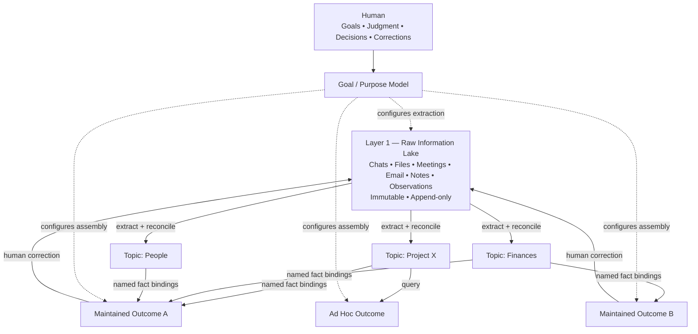
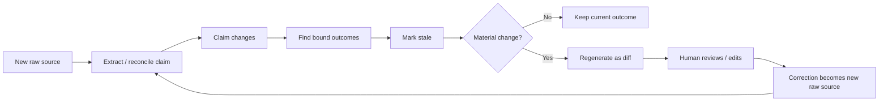
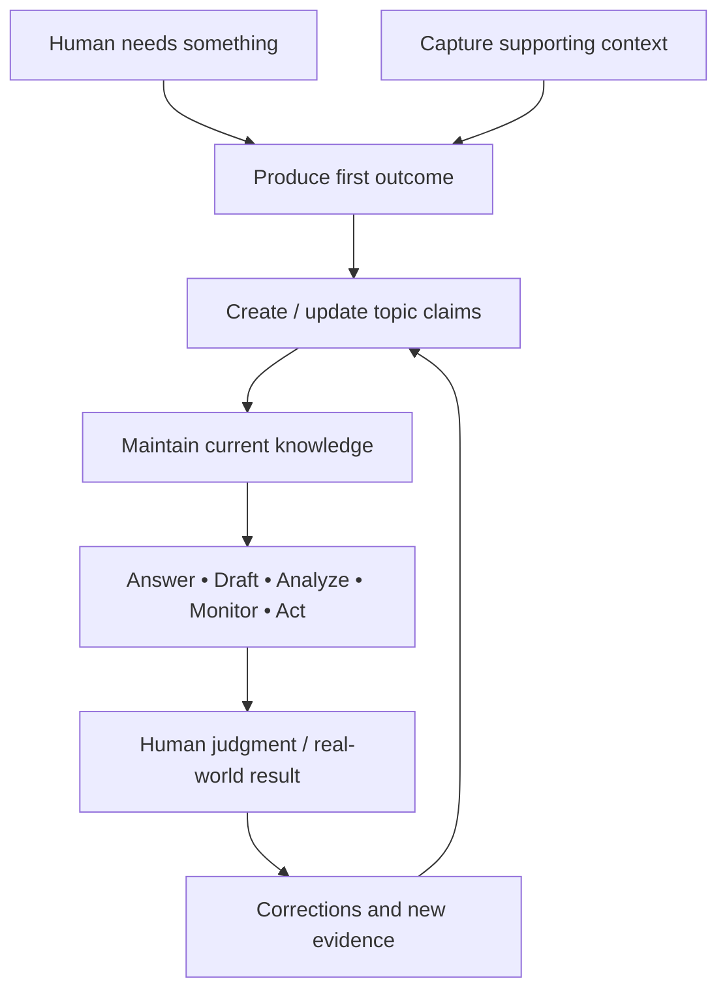
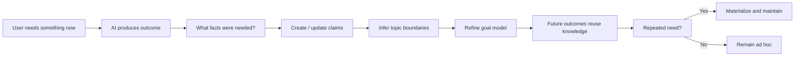
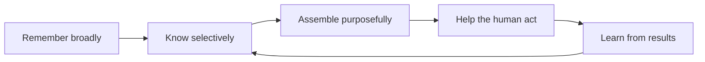

# Purpose-Driven Personal AI — 2-Page Core Summary

## 1. The idea in one sentence

**Do not try to make AI remember everything about a person. Make it understand what the person is trying to accomplish, then continuously organize what it learns around that purpose.**

The product vision starts from a simple problem: AI is already capable, but it is only useful when it has the right context. Today, people repeatedly have to explain their goals, prior decisions, constraints, changes, and current situation. A personal AI should reduce that synchronization burden.

The central bet is that the biggest bottleneck in personalized AI is **not model intelligence or the amount of stored data**. It is the absence of a system that continuously turns messy human information into a **small, current, purpose-shaped body of knowledge** that the AI can actually use.

---

## 2. The three-layer model

The architecture separates **what happened**, **what is currently believed**, and **what the user needs now**.

### Layer 1 — Raw Information Lake

The raw layer is broad, permissive, immutable, and append-only.

It can contain chats, files, meetings, emails, notes, screenshots, observations, tasks, decisions, imported data, and even human corrections made elsewhere in the system.

The user should not have to decide where something belongs before capturing it.

**Principle:** capture can be broad.

The raw layer is preserved because extraction will improve over time. If the source is never overwritten, the knowledge layer can later be rebuilt or reinterpreted.

### Layer 2 — Knowledge

The knowledge layer is **subject-oriented** rather than goal-oriented.

It stores the system’s current best understanding as **claims**. Each claim is:

- typed;
- named/addressable;
- versioned;
- linked to evidence;
- owned by exactly one topic;
- superseded rather than overwritten.

Examples of topics might be `Project X`, `Finances`, or `People`.

Knowledge is not a summary of everything in raw storage. A claim belongs here only when at least one current or plausible outcome needs it.

**Principle:** retention is demand-driven.

### Layer 3 — Outcomes

Outcomes are **views over knowledge**, not a third storage system.

An outcome is the thing the human actually reads, ships, decides from, or acts on: a plan, brief, answer, decision package, monitored state, draft, or report.

There are two forms:

- **Materialized outcome:** stored and automatically maintained.
- **Ad hoc outcome:** generated on demand and not maintained.

A one-off outcome can later be promoted simply by materializing the view.

**Principle:** assembly is purpose-driven.

---

## 3. The key architectural insight: ownership and consumption are different

Every knowledge claim has **one owning topic**. This gives reconciliation exactly one home and prevents multiple copies of the same fact from drifting apart.

But outcomes may consume claims from **many topics**.

For example, a board-review brief might need:

- project scope from the `Project X` topic;
- financial constraints from `Finances`;
- sponsor identity from `People`.

So:

> **Topic is the ownership boundary. Outcome bindings are the consumption boundary.**

This is one of the most important design choices in the document because it preserves reusable knowledge while still allowing purpose-specific outputs.

---

## 4. Facts are the contract between knowledge and outcomes

Outcomes should not re-read entire topic files.

Instead, they bind to **named facts**, such as:

- `project-x.current-scope`
- `project-x.committed-date`
- `people.sponsor.identity`

This creates three important properties:

1. **Targeted invalidation** — only outcomes that depend on a changed fact become stale.
2. **Computable blast radius** — the system knows how many outcomes a change affects.
3. **Representation freedom** — topic files can be reorganized internally without breaking consumers.

Claims are never overwritten. They are superseded with evidence and validity history. Materialized outcomes also record the exact fact versions used to build them.

That makes questions such as **“Why did this outcome change?”** and **“What did I believe last month?”** answerable.

---

## 5. Propagation is two-way, not just top-down

New information normally flows downward:

**Raw → Knowledge → Outcome**

But the most important learning signal flows upward.

If a human corrects an outcome, that correction must not remain only in the output. Otherwise the same error will appear again next time.

The correction should:

1. enter the raw layer as a new source;
2. update or supersede the relevant claim;
3. mark every dependent outcome stale.

The knowledge layer is intentionally lossy, so the system also needs an **escape hatch**: an outcome may read raw evidence through lineage when required. Every such case is logged as a **knowledge gap**.

Repeated gaps or repeated one-off questions are signals that the knowledge layer should learn to retain something new.

---

## 6. Human review should scale with consequence

The product should not ask the user to approve everything. That would simply replace manual organization with a manual review queue.

Instead, review is based on **blast radius**:

| Change | Default handling |
|---|---|
| New claim with no consumers | Auto-apply |
| Small, reversible change | Apply and flag |
| Change affecting many outcomes | Approve before applying |
| Topic split/merge | Review |
| Knowledge rebuild/schema change | Explicit reviewed migration |
| Unresolved contradiction | Ask the user |

Because Git makes most changes reversible, the system can safely use **apply-then-review** much more often than traditional approval-heavy systems.

---

## 7. Storage model

The proposed substrate is deliberately simple:

- **Files** hold knowledge content.
- **Git** holds history and causality.
- **Database** holds relationships, metadata, indexes, embeddings, and retrieval structures.

The critical rule is:

> **The database must be rebuildable from files and Git history. Nothing important exists only in the database.**

Human approvals therefore become commits, not just database rows.

This keeps the knowledge base portable, auditable, and reconstructable.

---

# Page 2 — Product Behavior and MVP

## 8. The product loop

The product is intended to become a long-running human–AI working relationship.

The human contributes the scarce parts:

- intent;
- goals;
- values;
- judgment;
- corrections;
- decisions;
- responsibility.

The AI performs the scalable work:

- capture;
- organization;
- extraction;
- synthesis;
- recall;
- analysis;
- drafting;
- tracking;
- monitoring;
- delegated execution.

The objective is not full synchronization between the human brain and AI memory. It is **sufficient synchronization of the goal-relevant context**.

---

## 9. The cold-start solution: begin with an outcome

A major product insight is that the system should **not** start by asking the user to define a perfect goal, ontology, and knowledge base.

That creates too much setup before value appears.

Instead:

1. Ask: **What do you need to produce right now?**
2. Produce the outcome.
3. Observe what information was actually needed.
4. Build topic boundaries and claims backward from demonstrated demand.
5. Infer and refine the user’s goal through the first few outcomes.

This makes the first session useful and ensures the knowledge layer grows from real needs rather than speculative curation.

---

## 10. What makes this different from RAG or a “second brain”

Traditional memory-centric systems optimize for:

> **Remember as much as possible.**

This product optimizes for:

> **Understand what I am trying to accomplish, then determine what must be known and maintained to help me accomplish it.**

RAG, vector search, transcripts, document storage, large context windows, and long-term memory may all be components, but none is the core product.

The differentiation is the continuously maintained **purpose-shaped model of the user’s world**.

A useful “second brain” should therefore answer more than *What do I remember?*

It should answer:

- What am I trying to accomplish?
- What currently matters?
- What changed?
- What have I decided?
- What is uncertain?
- What needs attention now?
- What can the AI do?
- Where is human judgment required?

This turns the system from a memory tool into a bridge between **memory and agency**.

---

## 11. What the MVP must prove

The MVP needs to test only one central hypothesis:

> **A purpose-driven knowledge layer makes a personal AI meaningfully more useful than an AI working directly over a large unstructured memory store.**

The strongest proposed metric is **knowledge-layer sufficiency rate**:

> What fraction of outcomes can be produced from the knowledge layer alone without dropping back to raw sources?

If this number rises over time, the knowledge layer is learning what is useful.

Supporting metrics include:

- human correction rate on regenerated outcomes;
- review queue volume per unit of input;
- gap-to-promotion latency;
- synchronization time per day;
- stale-outcome ratio.

The MVP should **not** become a universal life logger, generic RAG platform, workflow orchestrator, ontology-design tool, or autonomous agent.

---

## 12. The few ideas to remember

If you remember only seven things, remember these:

1. **Purpose, not memory volume, is the organizing principle.**
2. **Raw data is broad and immutable; knowledge is selective and maintained.**
3. **Knowledge is organized by subject, while outcomes are organized by purpose.**
4. **Every claim has one owner, but many outcomes can consume it.**
5. **Outcomes bind to named facts, enabling targeted invalidation and provenance.**
6. **Human corrections must update knowledge upstream, not just patch outputs.**
7. **Start with an outcome, prove immediate value, and let the knowledge model grow backward from demonstrated demand.**

### Mental model

**In short:** the vision is not to build the largest personal memory. It is to build the smallest continuously maintained body of knowledge that is sufficient for the AI to become a useful long-term collaborator.
