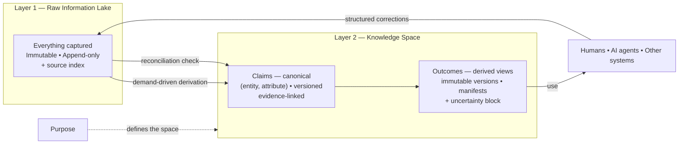

# Product Vision: Purpose-Driven Personal AI

**Working title:** Purpose-Driven Personal AI
**Document type:** Product Vision
**Status:** Early concept / foundation for product discovery
**Version:** v7.0 — claim identity made load-bearing; claims created on demand; review model reduced to defaults plus visible uncertainty
**Revised:** September 2, 2026

> **What changed in v7.0.** Claim identity is now `(entity, attribute)` rather than an extractor-invented name, and namespace stability is the first thing the MVP must validate (§4.3). A build manifest is the **input set** handed to the assembler, not the set it claims to have used (§5.2). Capture no longer produces claims — capture produces a source index, and **claims come into existence only through demand** (§6.4), which removes the prune-what-was-never-used machinery. Corrections are **structured sources** with a deterministic effect on claims (§6.3). Review has two states, silent and flagged; the learned escalation ladder, the gated state, and the sampling audit are gone (§8). Rendering uncertainty inside an outcome is promoted from open question to requirement, because it is the correction surface the whole model depends on (§8.4). Topic is a label, not an owning object — six core objects, not seven (§12). The MVP is a **comparison against a retrieval baseline**, not a build (§15). Removed: the published interface from v1, outcome spill-to-blob, the Collaborate view, five supporting metrics, and repeated statements of the thesis.

---

## 1. Vision

Build a personal AI system that stays meaningfully synchronized with a human — not by trying to remember everything equally, but by organizing knowledge around the outcomes the human is trying to achieve.

The long-term vision is a **human–AI working relationship** in which:

- AI performs most of the information processing, drafting, analysis, and coordination;
- humans remain responsible for intent, judgment, priorities, values, and important decisions;
- the AI continuously understands enough of the human's goals, work, and context to act as an effective extension of that person;
- keeping the AI informed requires relatively little effort from the human.

The knowledge base underneath that relationship is **consumer-agnostic**. It is shared working knowledge usable by a human, an AI agent, another software system, or any combination. It should not couple itself to who ultimately consumes an outcome.

The central product problem of the AI era follows:

> **How do we keep the human mind and the AI's working context sufficiently synchronized so that they can operate as one effective system?**

---

## 2. The Problem

An AI can only be useful when it has the right context, and most of the context that matters lives outside it: in the human's head, in conversations and meetings, in documents, in decisions made months ago, in changing priorities, in accumulated experience.

So people repeatedly explain themselves to AI systems — what they are working on, what happened earlier, what constraints exist, what was already decided, what changed, what they want next.

### The personalization paradox

The more an AI knows about a person, the more useful it can be. But collecting, organizing, and maintaining that information takes time, and most people will not become full-time curators of their own data. **A useful personal AI cannot depend on the user doing the curation.**

### Why "collect more" is not the answer

Most AI memory and "second brain" systems focus on collecting: record every meeting, save every document, index everything, put RAG over the corpus. This improves recall without solving the problem. If everything is stored with equal importance, relevant information competes with irrelevant information, old information conflicts with current information, decisions are buried among low-value details, and the user still has to reconstruct context. A better retrieval algorithm does not fix that.

The problem is not that a data lake is bad. The problem is expecting the data lake to *be* the personalized intelligence layer.

---

## 3. Core Insight: Purpose Comes Before Useful Memory

The missing organizing principle is **purpose**:

> **What is this knowledge supposed to help the human accomplish?**

Purpose tells the system what matters, what can be ignored, what should be tracked over time, which contradictions must be resolved, and which changes are significant.

The unit of that organization is a **Knowledge Space**: a bounded body of knowledge serving one goal, or a very small number of closely related goals. Examples:

- Launch my product and get the first 20 paying customers.
- Help me successfully lead Project X.
- Help me manage and improve my personal finances.
- Help me prepare my child for school.

> **Capture can be broad. Assembly must be purpose-driven. Knowledge exists because something needed it.**

**Purpose is not descriptive metadata.** It governs which knowledge the system creates at all, and which claims it assembles for a particular outcome.

### Sufficiency, not completeness

The system does not need to know everything about a person or project. It needs **enough of the right things for the outcomes that matter**. The objective is not `Human Brain = AI Memory`, nor `Raw Data = Knowledge Base`. It is closer to:

> Goal-relevant shared context ≈ what the human–AI system needs to work effectively

Cold starts at the edges are acceptable. The property that matters is that resolving one leaves reusable knowledge behind.

---

## 4. The Two-Layer Model

- **Layer 1 — Raw Information Lake.** One per system. Immutable, append-only, permissive.
- **Layer 2 — Knowledge.** One or more Knowledge Spaces. Each has one purpose, maintains claims, and produces outcomes.

**v1 has exactly one space.** A person eventually has several purposes, and the model's answer to that is a network of spaces — but that is a growth path, not a v1 feature (Appendix A). What v1 must do is stay cheap to grow into.

### 4.1 Layer 1 — Raw Information Lake

Intentionally permissive. The user should be able to put information in without deciding where it belongs.

Inputs may include conversations, voice notes, transcripts, emails, documents, screenshots, web pages, notes, calendar events, messages, photos, imported application data, and — importantly — **corrections, decisions, and real-world results produced anywhere else in the system**.

> **If the user thinks something might matter, make it easy to capture it.**

Some of it will never become useful. That is acceptable.

Immutability is not a stylistic preference: it preserves the original evidence so extraction and reconciliation logic can improve later without rewriting what actually entered the system.

There is exactly **one** lake. Multiple lakes would reintroduce a routing decision at capture time, which is the friction the lake exists to remove.

The lake is the one place where content lives as bytes in object storage. Every source is still registered in the database so that evidence links resolve to an identity and a locator rather than to a file path (§9.2).

**Capture does not produce claims.** It produces a **source index**: extracted text with segment locators, resolved entity mentions, a short summary, and an embedding. The index makes a source findable and makes it possible to ask *does this change anything I already believe?* — it does not decide what is worth knowing. That decision belongs to §6.4.

### 4.2 Layer 2 — Knowledge

Raw information becomes knowledge **inside a space**. A space has:

- **one purpose**;
- **claims** — typed, versioned, evidence-linked units of knowledge, addressed by a stable identity and owned exclusively by that space;
- **outcomes** — persisted views assembled from claims for a specific purpose;
- **one owner** (in v1, always the user).

```
┌─ Knowledge Space ────────────────────────────┐
│  Purpose (one goal, or a few related ones)   │
│        ↓                                     │
│  Claims      canonical: stable identity,     │
│              typed, versioned,               │
│              evidence-linked                 │
│        ↓                                     │
│  Outcomes    derived views: immutable        │
│              versions with build manifests   │
└──────────────────────────────────────────────┘
```

The knowledge layer answers: *what is currently true, and currently believed, in service of this purpose?* It is deliberately **not** a summary of the raw layer. New information can confirm, update, supersede, contradict, or add nuance to what is already held.

> **Claims are canonical. Outcomes are derived views over claims.**

A space in v1 exposes nothing to anything outside itself, because there is nothing outside itself. The **published interface** — the small named subset other spaces may bind to — belongs to the network growth path and is specified in Appendix A. What v1 owes the future is only that claims and outcomes are addressable by stable names, which they are for internal reasons anyway.

### 4.3 Claim identity is the load-bearing abstraction

Bindings, targeted invalidation, blast radius, correction routing, and every future cross-space contract rest on one property: **the same fact about the world resolves to the same claim every time**. If it does not, an extractor run in March creates `committed-date` and a run in June creates `launch-date`, both current, both correct, neither aware of the other. No uniqueness constraint catches this, because the two claims occupy different slots. The result is a knowledge layer that silently accumulates duplicate beliefs — which is the failure the whole design exists to prevent.

**A free-form name invented by a language model is not a stable identity.** So a claim is addressed as:

```
(space, entity, attribute)
```

- **Entity** is resolved through the entity registry (§12) — a person, organization, project, account, artifact, event, or the space's own subject. Entity resolution is a well-understood problem with known techniques (aliases, embeddings, deterministic keys where they exist, human disambiguation at the point of use) and a checkable answer, which "did the model pick the same string?" is not.
- **Attribute** is drawn from a per-entity-type attribute vocabulary that **grows but does not fork**: when the extractor proposes an attribute, it is matched against the existing vocabulary for that entity type first, and only creates a new one when no existing attribute is a match. The vocabulary is data in the database, not a schema — this is emergent structure with a memory, not an ontology defined up front (§7).
- The human-readable name (`project-x.committed-date`) is **derived** from the identity, not the source of it.

Not every claim is naturally an entity attribute — a lesson learned, an open question, or a constraint that spans several entities are the awkward cases. These attach to the most specific entity they concern, with the space's own subject as the fallback entity. Where that is genuinely wrong, the residual risk is duplication, and §16 measures it.

> **Open risk, deliberately named.** This is the assumption most likely to sink the model, and it cannot be settled on paper. **The first job of the MVP is to measure namespace stability** — how often does the same real-world fact, arriving twice through different sources or different extractor runs, land on the same claim identity? (§15, §16.) If that rate is low, the answer is a narrower claim vocabulary or a human-in-the-loop disambiguation step at claim creation, not more machinery downstream.

### 4.4 Outcomes: snapshot or maintained

Every outcome version is persisted as an immutable artifact with a build manifest. The only difference between the two kinds is **maintenance policy**:

- **Snapshot** — one stored version; later signals do not refresh it. An ad-hoc request is therefore not disposable; it becomes a durable record of what was needed and what was produced.
- **Maintained** — a logical outcome with a version history. When a bound claim changes materially, regeneration creates a new version and designates it current; older versions remain.

There is no promotion lifecycle. Changing the policy is a property change, not a migration — which is what allows the choice to be **defaulted rather than asked**. Every outcome starts as a snapshot. It becomes maintained when the system observes demand for currency: the same outcome is requested again, another outcome binds to it, or the user acts on it repeatedly. The user may override at any time and never has to decide up front.

Persisting outcomes also gives **pre-computed context packing** for reasoners under a context budget, which is a real consumer of this system.

---

## 5. Contracts: Names Are the Interface

Claims and outcomes are **addressable and typed**. Outcomes bind to claim identities, never to "whatever the retriever returned."

An outcome does not say "read everything about Project X." It says "I depend on `project-x.current-scope@v3`, `project-x.committed-date@v7`, `sponsor.identity@v1`."

This buys three things:

1. **Targeted invalidation.** When a claim changes, exactly the maintained outcomes bound to it can become stale.
2. **Computable blast radius.** The number of affected maintained outcomes is known, which makes it possible to rank what a change touches and to express any change in outcome terms rather than graph terms (§8).
3. **Representation freedom.** Internal representation can change without breaking consumers, as long as the named claims still resolve.

### 5.1 Claim versions are superseded, never overwritten

A claim may have multiple immutable versions, with one designated current. Each version records the evidence it derives from, when it became current, when it stopped being current, and what replaced it on what evidence.

This is a slowly changing dimension in the classical sense. The property that matters: **"why did this outcome change?" is answerable**, and any historical outcome can be reproduced from the claim versions it was built from.

### 5.2 The build manifest is the input set

A manifest records **the exact set of claim versions handed to the assembler**, not the set the assembler reports having used.

This distinction is not pedantic. A language model given thirty claims and asked which twelve it relied on will answer plausibly and unreliably; a manifest built from self-reported usage is a manifest that silently loses edges, which means invalidation silently stops firing. The input set is known deterministically by the code that assembled the context, so it is recorded by the code.

The cost is over-invalidation: an outcome may be flagged stale by a claim change that would not have altered a word of it. That cost is already absorbed by the materiality check (§6.2), which exists to decide whether a potentially-stale outcome actually needs regenerating. **Precision in the manifest is not worth buying with unreliability.**

The manifest makes regeneration a diff between two explicit builds rather than a mystery, and makes *what did this say before, what changed, and why?* directly answerable.

---

## 6. Propagation and Maintenance

Both outcome modes use the same knowledge path — assemble from claims, persist an immutable version and manifest. The difference is only whether the outcome participates in future maintenance.

### 6.1 Lineage in every hop

The system records which raw sources support which claim version, and which claim versions fed which outcome version. Without lineage, every new input forces broad recomputation — expensive, and worse, **nondeterministic**: re-derivation drifts, so an unchanged source can produce a changed result and trust erodes.

### 6.2 Materiality, not immediate recompute

The sequence is: claim changes → find bound **maintained** outcomes → mark potentially stale → let something cheap decide whether the change is **material** to each one → regenerate only where it is. Regeneration produces a new version with a diff and the triggering evidence attached.

Snapshot outcomes never enter this path.

Regeneration is **automatic by default and the default is not asked**. The user can pin an individual outcome to gated review; nothing in the system asks them to choose (§8).

### 6.3 The reverse edge: corrections are structured sources

The most valuable learning signal is an authoritative correction, decision, or real-world result arriving at the outcome boundary — usually from the human.

If a correction lives only in the outcome, the same error recurs next time, and the fix is silently overwritten on the next regeneration. Corrections therefore flow **upward**. But routing a correction through the same nondeterministic extraction path as a meeting transcript would make the most important signal in the system the least reliable one — the user says "the date is the 14th, not the 12th" and the extractor may or may not connect that to the claim that produced the error.

So a correction is a **structured source**: immutable evidence like any other, carrying an explicit payload.

```
correction {
  target:  claim identity (+ version that was wrong)
  kind:    revision | dispute | confirmation | scope-error
  content: the corrected value, or the disagreement
  origin:  user | external result | another system
}
```

The path is deterministic:

1. The correction lands in the raw layer as an immutable source, with its structured payload.
2. It supersedes the targeted claim (`revision`), records a contradiction against it (`dispute`), strengthens it (`confirmation`), or marks that the claim should not have been in the outcome at all (`scope-error`) — mechanically, not interpretively.
3. Bound maintained outcomes are reconsidered; snapshot outcomes remain historical records.

The target is known because the outcome that provoked the correction carries its manifest, and the uncertainty rendering (§8.4) names claims explicitly. A free-text correction with no resolvable target is still captured as an ordinary source; it just does not get the guarantee.

**An architecture with only downward arrows cannot learn from outcomes.**

### 6.4 Claims are created by demand

Raw→knowledge is lossy, and the temptation is to close that gap by extracting claims eagerly on capture. **This design does not.** Eager extraction produces a second, smaller lake — claims nothing asked for, competing for relevance with claims something did — and then needs a pruning mechanism to remove what was never used. That is a garbage collector compensating for a policy mistake.

Instead: **a claim comes into existence because an outcome needed it.**

When an outcome requires knowledge the space does not have:

1. search the source index and inspect the relevant raw sources;
2. derive the missing information;
3. create or reconcile claims at their resolved identity (§4.3), recording source→claim lineage;
4. bind the outcome to the exact versions and persist the outcome with its manifest.

Everything in the knowledge layer therefore has a demonstrated reason to exist, and retention needs no separate policy. Cold start and gap filling are the same mechanism (§14).

**The one thing that runs on capture** is narrow and closed-ended: given a new source, does it affect any **existing** claim? The source index provides the candidates by entity, the check is a comparison against a bounded set, and the outputs are supersessions, contradictions, and confirmations of claims already held. This is reconciliation, not open-ended extraction — it can only touch knowledge that already earned its place.

### 6.5 Idempotency lives in storage

In a deterministic pipeline, idempotency comes from transform purity. That guarantee does not exist here, so it must be enforced at the **storage layer**: content-addressed source keys, and exactly one current version per claim identity, held by a partial unique index. §4.3 is what makes the second of these meaningful — an identity that drifts makes the constraint enforceable and useless at the same time.

---

## 7. What This Is Not: Differences from Data Engineering

Decades of data engineering practice are relevant, and the project should borrow deliberately. Three borrowings are load-bearing:

- **Immutable raw with reprocessing optionality.** Most AI memory systems treat memory as one mutable store, which means an improved extractor can no longer inspect the original evidence.
- **Slowly changing dimensions.** §5.1 is SCD Type 2.
- **Structural-invariant testing.** You cannot assert that an extracted claim is correct. You can assert that every claim resolves to live evidence, that exactly one version is current per claim identity, and that every claim version an outcome binds to exists. Correctness moves to use and correction (§8).

Four differences force design decisions:

**One important consumer is a reasoner under a context budget, not a query engine.** A warehouse answers "can this question be answered." Here the system must also answer "does the right subset fit." Selection and compression are first-class concerns, and persisted outcome views are part of the answer.

**Truth is contested, not merely late-arriving.** Sources can legitimately disagree and the user can change their mind. **Contradiction is a representable state**, not an error condition.

**The human is an input channel.** No warehouse can ask a question. The cheapest way to resolve ambiguity is to ask the user, which means clarification is a designed, budgeted channel rather than ad hoc chat (§8.3).

**Volume is tiny.** Thousands of claims, not billions of rows. Full traversal, expensive per-item processing, and per-item human attention are all affordable. **Small-N is a design advantage to spend, not a limitation to work around.**

Three things explicitly not borrowed: a **global schema or ontology defined up front** (structure emerges, and §4.3 gives it a memory so that it stops drifting); **pipeline-centric architecture and scheduling** (the knowledge artifact is primary, processing is opportunistic and event-driven); and **completeness** (completeness thinking is the gravitational pull that drags the knowledge layer back into being a second data lake).

> Data engineering treats the **pipeline** as the asset, reprocessing as **cheap**, and **completeness** as the goal.
>
> This system treats the **knowledge artifact** as the asset, reprocessing as **expensive and lossy**, and **sufficiency** as the goal.

---

## 8. Human Review: Minimal and Reversible

The pattern is **AI does the work, human reviews what matters** — it substitutes for deterministic data-quality gates where judgment is required. Applied uniformly it fails, because review requests scale with input volume and the queue becomes the new job. A system that asks for a decision every time it is unsure has moved the work, not removed it.

> **Decisions are defaulted, not asked. Structure is applied, not approved. The human corrects rather than pre-approves.**

### 8.1 Reversibility is what licenses the default

Pre-approval buys protection against changes that cannot be undone. Inside this knowledge layer, almost nothing qualifies. Claim versions are superseded, never overwritten (§5.1); outcome versions are immutable and additive (§4.4); change records make every mutation causally traceable and revertible as one operation (§9.5).

So the question for any change is not "how big is it?" but **"can it be undone?"** Reversible changes are applied. Only these require approval before the fact:

- **deletion from the raw layer** — the one genuinely irreversible act in the system;
- **actions with effects outside the knowledge base** — sending, publishing, purchasing, committing on the user's behalf;
- **sharing or exposing knowledge to another party** (a multi-writer concern, Appendix B).

Everything else — new claims, supersessions, contradictions, attribute-vocabulary growth, entity merges, outcome regeneration — is applied and made visible.

**Undo is a first-class action.** Because every applied change has a change record, "revert this" is a supported operation on anything the user disagrees with. That is what makes applying-by-default honest rather than merely convenient.

### 8.2 Two states, one fixed rule

| State | Behaviour | Entry condition |
|---|---|---|
| **Silent** | Applied; visible only in the read-only Knowledge view | Default |
| **Flagged** | Applied; surfaced in the Inbox as "this changed, and why" | Weak or single-source evidence, a contradiction left open, or a recent user correction on a bound claim |

That is the whole ladder. There is no gated third state and no strictness the user configures.

A learned escalation model — deriving per-outcome strictness from observed correction rates — was specified in v6.3 and is removed here. For a single user producing a small number of outcomes and a small constant number of corrections per week, per-outcome correction rates are computed over an N of two or three. Thresholds tuned on that noise would either restore the review queue or hide real unreliability, and there is no window over which they become meaningful. Undo already provides what gating was protecting.

Correction rate is still measured (§16) — as evidence about whether the system works, not as a live control signal.

### 8.3 Ask at the point of use, not the point of ingestion

Most ambiguity never matters. A contradiction is a representable state (§7), not an error demanding immediate resolution: the system carries both readings with uncertainty visible and asks only when an outcome actually depends on the resolution. Clarification questions are ranked by value of information, batched, budgeted to a small number per period, and allowed to expire. **No outcome ever blocks on an unanswered question** — the system proceeds with its best current understanding and marks the uncertainty in the result.

### 8.4 Visible uncertainty is the correction surface — and it is a requirement

Everything above depends on one thing working: the system proceeds instead of asking, and the human catches what is wrong by reading the result. That only holds if the result **tells them where to look**. An outcome that hides its weak points converts "ask less" into "be wrong quietly," which is a worse product than the queue it replaced.

So this is a build requirement, not an open question. **Every outcome carries an explicit uncertainty block**, and the convention is fixed:

- a short list — typically two to five items, never a wall — appended to the outcome;
- each item names the **claim** in question, states what is uncertain (single weak source, unresolved contradiction, stale evidence, inferred rather than stated), and shows the value being assumed;
- each item is **directly correctable in place**, and a correction there emits the structured source of §6.3 with the claim identity already resolved;
- items are ranked by how much the outcome would change if the assumption were wrong, not by model confidence.

This single affordance closes the reverse edge. It is the **primary correction gesture** in the product, and the main way the knowledge layer learns.

### 8.5 The budget

Required decisions per week should be **a small constant**, not a function of input volume. §16 tracks this. If it climbs with capture volume, the review model has failed regardless of how good the knowledge is, and the correct response is to convert the most frequent decision back into a default with an undo.

---

## 9. Storage Substrate

> **Design decision (v6.2, unchanged).** Object storage holds **source bytes**. The **database is the system of record for the entire knowledge layer** — claims, claim versions, outcomes, manifests, bindings, lineage, and change history, including their content and not merely their structure.

### 9.1 Why the knowledge layer is not files

Nearly every load-bearing operation in this model is a join or a small graph traversal over many small records:

- **targeted invalidation** (§5) — a claim version changes, find the maintained outcomes bound to it;
- **blast radius** (§8) — count and rank those outcomes;
- **"why did this change?"** (§5.2) — manifest → claim versions → supersession chain → evidence;
- **structural invariants** (§7) — every claim resolves to live evidence, exactly one current version per identity, every bound claim version exists;
- **identity resolution** (§4.3) — match an incoming entity mention and attribute against existing ones, which is a lookup plus a similarity search;
- **claim creation on demand** (§6.4) — create claims, record lineage, and bind an outcome **as one operation**.

Over a blob store, each of these requires a hand-built index that must be kept consistent with the blobs — which is a database, written badly and without transactions. In a relational database they are foreign keys, a partial unique index on `(space_id, entity_id, attribute) WHERE is_current`, a transaction, and a recursive query.

Scale does not argue the other way. At 1000+ spaces with thousands of claims each and several versions per claim, the knowledge layer is single-digit millions of rows — unremarkable for a single relational instance. The §7 observation that volume is tiny argues for affordable per-item processing, not for file-based storage.

### 9.2 The split

- **Object storage — source bytes only.** Transcripts, documents, screenshots, audio, photos, imported exports. An abstraction, not a vendor commitment: local files first is fine.
- **Database — everything else.** Every Source also has a **row**: identity, content hash, captured-at, channel, media type, blob URI, and its source index (§4.1). Lineage and evidence links point at source identities and segment locators, never at URIs — evidence should resolve to "paragraph 14 of this transcript," not to a 40 MB file.
- **Claim versions live entirely in the database.** Payload as a document/JSON column so claim types stay open (§12), with structured columns only for what the invariants and queries need: identity (space, entity, attribute), type, version, validity window, supersedes, author, timestamp.
- **Outcome versions live entirely in the database too** — manifest, metadata, and rendered body. Outcome bodies are text of a few kilobytes. A size threshold with a spill-to-blob path was specified in v6.3 and is removed: it added a second storage path, a pointer column, and an inconsistency in how outcomes diff and reproduce, in exchange for a case that has not occurred. If an outcome ever genuinely *is* a large binary artifact, it is a generated file produced *from* an outcome, which is a different object.

### 9.3 What the database must enforce that a blob store gave for free

Append-only storage made immutability structural. A database makes it a discipline, so it has to be enforced deliberately:

- version tables are **insert-only**; the only mutation is advancing a current-version pointer, ideally held in its own table rather than as a flag;
- change records are an **append-only ledger**;
- `UPDATE`/`DELETE` on version and change tables is denied at the database level (trigger or role permission), not merely avoided in application code.

The KB's history remains represented explicitly in its own data model. The architecture does not depend on Git, on blob-store versioning, or on any storage-engine feature to represent supersession.

### 9.4 Supporting commitments

**One database, not several.** A relational engine with document columns, vector search, and recursive queries covers the open claim types, embedding retrieval and entity resolution, and the future space DAG. The network in Appendix A is shallow and small; it does not justify a separate graph store.

**Space identity is on every row.** `space_id` is required from the first write (§15). Carrying it on every row makes it the natural key for row-level access control — the seam the multi-writer path in Appendix B will need.

**Periodic export to object storage.** A plain portable snapshot of the knowledge layer (line-delimited JSON per table, written to object storage on a schedule) covers disaster recovery and user data portability. It is a complement, never on the hot path.

### 9.5 Change Records carry causality

Version history says *what* changed; trust also requires *why*. A change record captures the change, the previous and new versions, the triggering source or decision, who or what made it, and when. One change record may group several mutations from the same causal event — a new source superseding one claim and regenerating three outcomes shares one change ID. This lets the database answer *what did I believe on this date?*, *what changed since then?*, and *why did this outcome change?*

---

## 10. The Core Loop

1. **Name the goal.** One sentence from the user, once. The system expands it into a working purpose — desired outcome, success criteria, constraints, time horizon — from the outcomes actually requested, and keeps it current as a versioned claim. The human edits it when the draft is wrong, which is a correction, not a setup step.
2. **Capture.** Very low friction; capture must be easier than organization. Connect to existing sources with permission to reduce manual entry. Capture produces a source index, not claims.
3. **Request an outcome.** Something the human needs produced or decided now.
4. **Assemble what exists.** Purpose decides which existing claims are relevant.
5. **Fill the gaps.** Where knowledge is insufficient, consult raw sources, derive the missing claims at their resolved identity, and record lineage (§6.4).
6. **Deliver and persist.** The outcome is persisted with its bindings and manifest, and rendered with its uncertainty block (§8.4).
7. **Act.** The AI answers questions, drafts work, prepares decisions, identifies missing information, suggests next steps, and prepares the human for judgment calls.
8. **Learn.** Corrections and real-world results enter as structured sources, supersede claims, and stale the maintained outcomes bound to them (§6.3). New sources are checked against existing claims for reconciliation.

---

## 11. Core Principles

1. **Purpose before organization.** Do not ask the user to design folders, ontologies, or taxonomies before the system is useful.
2. **Capture first, structure later.** Input friction extremely low; AI does the organizing.
3. **Raw memory and useful knowledge are different things.** Never treat the archive as the AI's working memory.
4. **Relevance is purpose-dependent.** The same fact can be essential for one purpose and irrelevant for another.
5. **Knowledge exists because something needed it.** Claims are created by demand, not in anticipation; there is no separate retention policy because there is nothing unearned to retain.
6. **Identity before inference.** The same fact must resolve to the same claim every time, or none of the downstream guarantees hold.
7. **Memory evolves.** Maintain current understanding; supersede rather than accumulate.
8. **Minimize synchronization cost.** The system fails if keeping it informed becomes another job.
9. **Preserve provenance and make uncertainty visible.** Knowledge retains a link to its evidence; conflicts, gaps, and low confidence are explicit in the result rather than smoothed over. Source information stays distinguishable from AI-generated conclusions.
10. **Derived knowledge is an asset, not a cache.** Re-derivation is expensive and nondeterministic, so knowledge is preserved and versioned rather than regenerated on a whim.
11. **Corrections travel upward, and deterministically.** A fix applied only to an outcome will be undone the next time it regenerates; a fix that has to be re-inferred may never land at all.
12. **Review scales with consequence, not volume.** Human attention is reserved for what is irreversible or externally consequential; everything else is applied, recorded, revertible, and legible.
13. **Default rather than ask.** Any decision the system can make and later reverse, it makes. A feature that adds a required human decision must justify why it cannot be a default with an undo.
14. **Outcome-first, structure-on-demand.** The human works with outcomes and their purpose. Claims, bindings, entities, and the eventual space network are always inspectable and never required knowledge; structural changes are expressed in terms of the outcomes they affect.

---

## 12. Core Objects

The first implementation does not need a complex ontology. **Six objects** carry the model.

| Object | Definition |
|---|---|
| **Source** | Raw information entering the system. Immutable. Carries a source index (text, segment locators, entity mentions, summary, embedding) and, for corrections, a structured payload (§6.3). |
| **Space** | A bounded body of knowledge serving one purpose. Owns entities, claims, and outcomes. v1 has one. |
| **Entity** | A person, organization, project, account, artifact, event, or subject, resolved once so the same person does not exist three times. Part of claim identity (§4.3), not decorative metadata. |
| **Claim** | A typed unit of knowledge addressed by `(space, entity, attribute)`. May have many immutable **versions**, one designated current, each evidence-linked with its validity period and supersession record. Types are open: fact, decision, preference, constraint, observation, hypothesis, risk, question, lesson, and others as needed. |
| **Outcome** | A persisted view over claims serving one specific purpose. Has a maintenance mode (snapshot or maintained) and one or more immutable **versions**, each with a build manifest and an uncertainty block. |
| **Binding** | The declared dependency from an outcome version to the claim versions handed to its assembler. The unit of provenance, targeted invalidation, and correction routing. A build manifest is the binding set of one outcome version. |

**Change Record** is the seventh table and not a seventh concept: an append-only ledger row emitted by every mutation (§9.5). It is infrastructure the model depends on, not an object anyone models against.

**Topic is gone as an owning object.** In v6.3 a topic owned claims, which bought a re-homing lifecycle, a redirect mechanism, and an open question about how boundaries get revised — for a structure that is AI-managed, invisible to the user, and, in a single space, doing no work that claim identity does not already do. Subject grouping is still useful for display and for scoping the reconciliation check, so **topic survives as a label on the claim**: derived, non-authoritative, freely recomputable, and breaking nothing when it changes. When the network arrives (Appendix A), the unit of ownership is the space.

---

## 13. Conceptual Architecture



The important separations:

- **Raw information** preserves what entered the system. There is exactly one lake, and it holds no knowledge.
- **The space** maintains the current best understanding needed for one purpose, and everything in it was demanded.
- **Claims are canonical; outcomes are derived** and bound to the exact versions handed to the assembler.
- **Consumers are outside the architecture.** The same knowledge serves humans, agents, and other software without changing the model.

Substrate: **object storage for source bytes; the database for the whole knowledge layer** (§9).

---

## 14. Bootstrapping: Start from the Outcome

Cold start is not only a new-knowledge-base problem. It occurs whenever the knowledge layer is insufficient for a desired outcome — both when the KB is new and when a mature KB meets a new problem. Both use the mechanism of §6.4:

1. Ask what needs to be produced or decided **now**.
2. Attempt to assemble it from existing claims.
3. Where knowledge is insufficient, consult raw sources and/or request the minimum additional context.
4. Create or reconcile the missing claims at their resolved identity and record lineage.
5. Produce and persist the outcome with its bindings, manifest, and uncertainty block.

The knowledge layer therefore accretes **backwards from demonstrated demand**. The first interaction on a new problem still delivers value instead of requiring weeks of setup, and the same area becomes progressively warmer.

The purpose model is elicited **through** actual outcomes rather than demanded before any useful work is done.

---

## 15. MVP

### Hypothesis

> **A purpose-driven knowledge layer can make a personal AI meaningfully more useful than an AI operating directly over a large unstructured memory store.**

### The MVP is a comparison, not a build

The hypothesis is comparative, so the MVP must be too. Building the knowledge layer and watching its sufficiency rate climb demonstrates that the system is learning — not that the knowledge layer beats the alternative it claims to beat.

**The design of the test:**

- **Same corpus.** One real goal, one space, a few input channels, and one raw lake.
- **Two arms.** (A) The knowledge layer of this document. (B) A competent retrieval baseline over the same lake — chunking, embeddings, a strong reranker, the same underlying model, no claims and no outcomes. The baseline must be *good*, not a straw man; if a well-built RAG matches the knowledge layer, that is the most valuable thing this project can learn, and it should be learned in month one rather than year two.
- **Same requests.** Every outcome request is answered by both arms.
- **Blind judgment.** Results are presented unlabelled and scored on usefulness, correctness against known facts, and whether the user had to re-supply context they had already given.
- **The comparison sharpens over time.** The interesting divergence is not on the first request — it is on the tenth request in the same area, after the world has changed underneath both arms. The baseline has every source; only arm A knows which belief superseded which.

Run the comparison until the answer is stable, then stop running it. It is a validation harness, not a permanent feature.

### What the MVP must validate first

In priority order:

1. **Namespace stability (§4.3).** Does the same real-world fact, arriving through different sources at different times, land on the same claim identity? Everything else assumes it does. Measure it before building on it.
2. **Correction routing (§6.3).** When a user corrects an outcome, does the right claim change, and does the error stop recurring?
3. **The comparative hypothesis** above.

### Keep the later network cheap without building it

- every claim records its owning space from the first write;
- claims and outcomes are addressable by stable identity, so publishing one later is a property change, not a migration;
- bindings are stored explicitly, so a cross-space binding is the same mechanism with a different endpoint;
- every claim version has an author and a timestamp, so multi-writer attribution is not a backfill.

The second space appears when the first one's purposes visibly diverge (Appendix A).

### Experience

1. **The user names the goal in one sentence.** This is the only setup decision, and it exists because it is what makes the system purpose-driven rather than a chat window over a lake. Everything else is defaulted.
2. The user names something that needs to be produced now — the first outcome.
3. The system checks existing claims.
4. Where knowledge is insufficient, the system consults raw sources and proceeds with its best understanding, marking what it is unsure of rather than stopping to ask.
5. The system creates or reconciles the claims the outcome requires, with evidence and lineage.
6. The outcome is persisted as an immutable version bound to the exact claim versions used, delivered with its uncertainty block.
7. Maintenance mode is defaulted, not asked: snapshot at first, promoted to maintained when demand for currency appears (§4.4).
8. The user reacts to the outcome. Corrections — most often made directly on an uncertainty item — flow upward as structured sources and supersede claims. **This is the primary review channel.**
9. New signals stale only maintained outcomes; a material refresh creates a new version and advances the current pointer, applied silently or surfaced in the Inbox according to §8.2.
10. Clarification questions are budgeted, batched, and expirable; nothing blocks on them.

**Beyond naming the goal, the first session requires no setup decisions.** No purpose statement, no maintenance policy, no structure, no review preferences — only a request and a result.

### Build it on one real goal first

The remaining uncertainties in this document are ones a running system answers and a document cannot. Pick one live goal of the author's own, implement the six objects on Postgres, and let the first fifty claims settle what a claim is. Generalize afterwards.

### Initial surfaces

- **Conversation** — where outcomes are requested and delivered, and where corrections are made. The working surface.
- **Inbox** — what entered the system, what it changed, what is now stale, and what — rarely — needs a decision.
- **Knowledge** — read-only inspection of what the system currently understands, how it is organized, and why anything changed.

**Knowledge is inspection, not operation** (Principle 14): always available, never required to get value, and read-only — a correction made from it enters as a structured source rather than editing a claim in place, because a fix applied directly to knowledge has no reconciliation record (§6.3). It also serves as the builder's debugging and evaluation surface for a process that is nondeterministic by construction.

A separate "Collaborate" surface — what should the human and AI think about or do next — was specified in v6.3 and is removed. Its content is either an outcome (so it belongs in the conversation) or a change the system wants to surface (so it belongs in the Inbox). A third surface with no content of its own is a fourth place to look.

The user should be *able* to see the evolving shared working model rather than interacting only through a chat window — and should never be *obliged* to.

### What the MVP should not try to be

A universal life-logging platform; a replacement for every note-taking app; a document management system; an enterprise knowledge graph; an unbounded autonomous agent; a perfect memory of a life; an ontology-design product; a generic RAG platform; a workflow orchestration platform; a complete data warehouse for a person's life; a system that asks approval for everything; a system with a settings page for review policy; or a network of thin spaces built before one space has demonstrated value.

---

## 16. Measuring Whether the Bet Is Working

### Primary metric — knowledge layer sufficiency rate

> What fraction of desired outcomes can be produced from the knowledge layer without dropping to raw sources or requesting new context?

If this does not climb within recurring problem areas, the core bet is wrong or the knowledge layer is retaining the wrong things. It is meaningful only alongside the baseline comparison (§15) — a rising sufficiency rate proves learning, not advantage.

### Supporting metrics

Three, deliberately. More metrics than the team acts on is another form of the completeness trap.

- **Claim identity collision rate** — how often does the same real-world fact end up under two claim identities, and how often does the system merge them after the fact? This measures the assumption of §4.3 and is the leading indicator of whether the model holds.
- **Correction rate on regenerated maintained outcomes** — does propagation produce trustworthy results? Reported as evidence, not consumed as a control signal (§8.2).
- **Required decisions per week** — a **constraint, not an observation**. The target is a small constant, flat with respect to capture volume. If it correlates with how much information entered the system, §8 has failed and the most frequent decision must be converted back into a default with an undo.

Gap-to-claim latency, knowledge reuse rate, stale-outcome ratio, synchronization time per day, and audit agreement rate are all computable from the same data if a question ever needs them. They are not dashboards for v1.

---

## 17. Differentiation and the Bet

The product is not differentiated by having a chatbot, storing documents, vector search, RAG, transcription, note taking, a large context window, or long-term memory by itself. Those may all be components.

The differentiation is the ability to maintain a **purpose-shaped model of the user's world**:

> Memory-centric: *"Remember as much about me as possible."*
>
> Purpose-driven: *"Understand what I am trying to accomplish, then continuously determine what you need to know in order to help me accomplish it."*

**The bet:**

> **The bottleneck to highly useful personalized AI is not model intelligence or access to more data. It is the absence of a purpose-driven system that continuously converts messy context into useful, current, reusable shared knowledge.**

**The vision statement:**

> **Create a purpose-driven personal AI that continuously transforms a person's messy stream of information into a small, evolving, shared body of knowledge that humans and AI agents can use together to achieve important outcomes — so AI can do more of the cognitive heavy lifting while humans remain focused on intent, judgment, and responsibility.**

**In one sentence:**

> **Don't try to make AI remember everything about a person; maintain the shared knowledge that humans and AI agents actually need for the outcomes they are trying to achieve.**

**The question the project is built around:**

> **What is the minimum synchronization effort needed to maintain enough shared context for humans and AI agents to operate as one effective system over time?**

---

## 18. Open Design Questions

1. **How stable is claim identity in practice, and what is the fallback?** §4.3 proposes `(entity, attribute)` with a growing-but-not-forking attribute vocabulary. If measured collision rates stay high, the candidate answers are a narrower claim vocabulary, a stricter entity-resolution step, or human disambiguation at claim creation — each of which costs something this design has been trying not to spend.
2. **What is the right granularity of a claim?** Too fine and the namespace becomes unmanageable and binding brittle. Too coarse and targeted invalidation stops being targeted. Related to (1) but not the same question: identity is *whether* two things are the same claim; granularity is *how much* one claim should hold.
3. **Which claims should be handed to the assembler?** The manifest is now the input set (§5.2), which makes the manifest honest but moves the difficulty to selection: too few and the outcome is thin, too many and invalidation over-fires and the context budget is wasted.
4. **How do entity-attribute claims accommodate the awkward cases?** Lessons, open questions, and cross-entity constraints attach to the most specific entity they concern, with the space's subject as fallback. Whether that is adequate or a second addressing scheme is needed is unresolved.
5. **What is the retention policy for the raw layer?** Immutability implies unbounded growth. At what point does that become a cost or privacy problem, and what goes first?
6. **How is a superseded claim distinguished from a contradicted one?** "I changed my mind" and "two sources disagree" have the same shape and different correct handling. The structured correction kinds of §6.3 handle the case where the user says which it is; sources disagreeing on their own do not announce it.
7. **How long should snapshot outcomes be retained?** They are useful as demand history and reproducibility artifacts, but indefinite retention carries privacy and storage cost.
8. **What is the concrete signal that the single space should become two?** Divergence of purpose is the stated criterion; it is not yet operational. A candidate: two clusters of outcomes that share few bound claims.
9. **Where does the single-database substrate stop being enough?** §9 asserts that millions of rows across 1000+ spaces is unremarkable. Pressure is more likely to come from embedding volume, per-space isolation requirements, or export size than from row count.
10. **Does silence mean acceptance?** §8 treats use without correction as weak evidence of correctness. That is plausible for an outcome the user reads closely and false for one they skim, and the system cannot currently tell the difference. The uncertainty block (§8.4) is the mitigation, not the answer.
11. **Is a periodic sampling audit worth adding later?** It was specified in v6.3 and removed as premature. If use-is-review proves too weak — plausible if (10) turns out badly — a small random sample of recent claim changes offered for verification is the cheapest thing to add back.
12. **How much uncertainty is legible before it becomes noise?** §8.4 fixes the convention but not the volume. An uncertainty block that is always five items long will be skipped as reliably as one that is empty.

---

## Appendix A — Growth Path: A Network of Spaces

This is where the model goes when one space is no longer enough. **None of it is v1.** It is recorded here so that the v1 commitments in §15 are understood as deliberate rather than accidental.

A person has several purposes, at different scales and lifetimes. The answer is many spaces on the shared raw lake, composing into a directed acyclic graph.

**Two flavours.** The distinction is descriptive, not a separate type:

| | **Base space** | **Goal space** |
|---|---|---|
| Purpose | *Maintain the current truth about X* | *Achieve Y* |
| Lifetime | Long-lived, often permanent | Finite; ends when the goal ends |
| Typical inputs | Raw lake, mostly | Base spaces, plus raw lake |
| Examples | People and relationships; Finances; Health | Launch the product; Prepare my child for school |

Lower in the network, spaces tend to be subject-oriented and durable; higher, goal-oriented and finite. This is what makes goal completion safe: archiving a goal space does not delete the durable knowledge it consumed, because that knowledge was never owned by it.

**Composition.** When an outcome needs knowledge from several spaces, the answer is not to widen a space or let one reach into another's internals. It is a **new higher-level space** whose purpose is that cross-cutting outcome, consuming the published outputs of the others.

**The published interface.** This is where it becomes real. A space exposes a small named subset of its outcomes and claims; a consuming space binds only to those names, never to internal claims. Publish several small, well-named outputs rather than one large export, or targeted invalidation is lost at every boundary. The published interface should stay deliberately narrower than what the space knows, because it is the only part that is expensive to change. In v1 this costs nothing to prepare for: claims and outcomes are already addressable by stable identity, so publishing one is a property change.

**The one hard constraint: the reference graph must be a DAG.** Cycles destroy termination of propagation, reproducibility of a build manifest, and any honest answer to "why did this change?" A cycle attempt is a signal: either the two spaces are one space, or the shared part belongs in a third space below both.

**Ownership is single; dependency is many-to-many.** Every claim has exactly one owning space, never co-owned or duplicated. Single ownership means reconciliation has one home. Splitting a space is therefore a contract change, not a rename: every published name must keep resolving or carry an explicit redirect.

**Corrections route to the owning space.** This is the rule most easily got wrong. If a goal space notices a consumed fact is wrong, it must not fix it locally — a local fix creates a divergent belief with no reconciliation home and is silently overwritten on the next refresh.

**Splits are applied, not approved.** Because published names must keep resolving or carry an explicit redirect, a split is reversible and invisible to consumers, so it falls under §8.1: the system proposes, applies, and flags it in the Inbox in terms of the outcomes affected — never as a graph edit the user must adjudicate. Over-fragmentation is guarded by making the split criterion operational and conservative, not by asking a human every time.

**Entity identity across spaces** becomes a question the moment there are two spaces: the same person should not be resolved independently in each. The likely answer is that the entity registry is system-wide while claims remain space-owned — but it is not settled, and v1 does not have to settle it.

**Open network questions:** what stops space proliferation (over-fragmentation is the likely failure mode); what the operational threshold for splitting is; what happens to a completed goal space that downstream spaces still bind to; whether base/goal ever becomes a real type.

## Appendix B — Growth Path: Multi-Writer

The first version is single-user and simplicity should win. A few decisions determine whether multi-writer is a later feature or a later rewrite.

**Must be true from the start** (all already required by v1 for other reasons):

- every claim version has an author and a timestamp;
- every claim has exactly one owning space — the space is also the natural future unit of access control and sharing;
- claims and outcomes are addressable by stable identity, so a published interface can be introduced without re-addressing anything;
- changes are durable change records, so there is a shared auditable record of who changed what and why;
- contradiction is a representable state — single-user contradiction is changing your mind, multi-writer contradiction is disagreement; the representation is the same and only the resolution policy differs.

**Can safely wait:** access control and visibility scoping, per-user views, conflict resolution and merge semantics, notification and subscription models, and anything resembling Data Mesh's organizational layer.

The distinction is between decisions that are cheap now and expensive later, and decisions that are simply features. Only the first list constrains v1.
