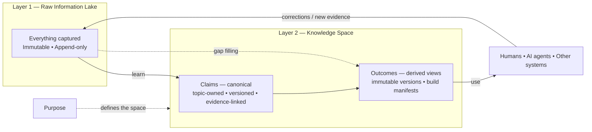

# Product Vision: Purpose-Driven Personal AI

**Working title:** Purpose-Driven Personal AI
**Document type:** Product Vision
**Status:** Early concept / foundation for product discovery
**Version:** v6 — simplified to the load-bearing core
**Revised:** September 2, 2026

---

## 1. Vision

Build a personal AI system that stays meaningfully synchronized with a human — not by trying to remember everything equally, but by organizing knowledge around the outcomes the human is trying to achieve.

The long-term vision is a **human–AI working relationship** in which:

- AI performs most of the information processing, drafting, analysis, and coordination;
- humans remain responsible for intent, judgment, priorities, values, and important decisions;
- the AI continuously understands enough of the human's goals, work, and context to act as an effective extension of that person;
- keeping the AI informed requires relatively little effort from the human.

The knowledge base underneath that relationship is **consumer-agnostic**. It is shared working knowledge usable by a human, an AI agent, another software system, or any combination. It should not couple itself to who ultimately consumes an outcome.

The central product problem of the AI era follows:

> **How do we keep the human mind and the AI's working context sufficiently synchronized so that they can operate as one effective system?**

---

## 2. The Problem

An AI can only be useful when it has the right context, and most of the context that matters lives outside it: in the human's head, in conversations and meetings, in documents, in decisions made months ago, in changing priorities, in accumulated experience.

So people repeatedly explain themselves to AI systems — what they are working on, what happened earlier, what constraints exist, what was already decided, what changed, what they want next.

### The personalization paradox

The more an AI knows about a person, the more useful it can be. But collecting, organizing, and maintaining that information takes time, and most people will not become full-time curators of their own data. **A useful personal AI cannot depend on the user doing the curation.**

### Why "collect more" is not the answer

Most AI memory and "second brain" systems focus on collecting: record every meeting, save every document, index everything, put RAG over the corpus. This improves recall without solving the problem. If everything is stored with equal importance, relevant information competes with irrelevant information, old information conflicts with current information, decisions are buried among low-value details, and the user still has to reconstruct context. A better retrieval algorithm does not fix that.

The problem is not that a data lake is bad. The problem is expecting the data lake to *be* the personalized intelligence layer.

---

## 3. Core Insight: Purpose Comes Before Useful Memory

The missing organizing principle is **purpose**:

> **What is this knowledge supposed to help the human accomplish?**

Purpose tells the system what matters, what can be ignored, what should be tracked over time, which contradictions must be resolved, and which changes are significant.

The unit of that organization is a **Knowledge Space**: a bounded body of knowledge serving one goal, or a very small number of closely related goals. Examples:

- Launch my product and get the first 20 paying customers.
- Help me successfully lead Project X.
- Help me manage and improve my personal finances.
- Help me prepare my child for school.

> **Capture can be broad. Retention is demand-informed. Assembly must be purpose-driven.**

---

## 4. The Two-Layer Model

- **Layer 1 — Raw Information Lake.** One per system. Immutable, append-only, permissive.
- **Layer 2 — Knowledge.** One or more Knowledge Spaces. Each has one purpose, maintains claims, and produces outcomes.

**v1 has exactly one space.** A person eventually has several purposes, and the model's answer to that is a network of spaces — but that is a growth path, not a v1 feature (Appendix A). What v1 must do is stay cheap to grow into.

### 4.1 Layer 1 — Raw Information Lake

Intentionally permissive. The user should be able to put information in without deciding where it belongs.

Inputs may include conversations, voice notes, transcripts, emails, documents, screenshots, web pages, notes, calendar events, messages, photos, imported application data, and — importantly — **corrections, decisions, and real-world results produced anywhere else in the system**.

> **If the user thinks something might matter, make it easy to capture it.**

Some of it will never become useful. That is acceptable.

Immutability is not a stylistic preference: it preserves the original evidence so extraction and reconciliation logic can improve later without rewriting what actually entered the system.

There is exactly **one** lake. Multiple lakes would reintroduce a routing decision at capture time, which is the friction the lake exists to remove.

### 4.2 Layer 2 — Knowledge

Raw information is filtered, extracted, reconciled, and maintained as knowledge **inside a space**. A space has:

- **one purpose**;
- **claims** — named, typed, versioned, evidence-linked units of knowledge, organized by topic and owned exclusively by that space;
- **outcomes** — persisted views assembled from claims for a specific purpose;
- **a published interface** — the small subset of outcomes and claims that anything outside the space may bind to;
- **one owner** (in v1, always the user).

```
┌─ Knowledge Space ────────────────────────────┐
│  Purpose (one goal, or a few related ones)   │
│        ↓                                     │
│  Claims      canonical: named, typed,        │
│              versioned, evidence-linked,     │
│              organized by topic              │
│        ↓                                     │
│  Outcomes    derived views: immutable        │
│              versions with build manifests   │
│        ↓                                     │
│  Published   the subset others may bind to   │
└──────────────────────────────────────────────┘
```

The knowledge layer answers: *what is currently true, and currently believed, in service of this purpose?* It is deliberately **not** a summary of the raw layer. New information can confirm, update, supersede, contradict, or add nuance to what is already held.

> **Claims are canonical. Outcomes are derived views over claims.**

### 4.3 Topic decides where; purpose decides whether

Within a space, claims are organized **by topic**. Subject-oriented organization gives reconciliation a single home and lets internal representation evolve without breaking bindings. Every claim has exactly one owning topic.

The cost of topic organization is that topic relevance is broad — left alone, a space drifts into being a second, smaller data lake. Purpose is the counterweight: a claim earns its place because it serves the space's purpose, and **demonstrated use is the evidence that it does**.

- **Topic decides where a claim lives.**
- **Purpose decides whether it should exist at all.**
- **Outcome bindings are the running record of which claims have proven necessary.**

> **Design decision (resolves a contradiction in v5).** Retention is *demand-informed*, not strictly demand-gated. Extraction may run on capture; a claim does not require a pre-existing outcome to be created. But claims that no outcome has ever needed are prunable, and the binding record is what tells the system which those are. The strict version — "an active claim with no outcome dependency is a model violation" — is unimplementable alongside a capture-time extraction loop, and forcing the two to agree was adding machinery without adding value.

When a new outcome requires knowledge the space does not have, the space consults raw sources, derives the needed claims, persists them with lineage, and binds the outcome to them as one operation (§6.4).

### 4.4 Outcomes: snapshot or maintained

Every outcome version is persisted as an immutable artifact with a build manifest. The only difference between the two kinds is **maintenance policy**:

- **Snapshot** — one stored version; later signals do not refresh it. An ad-hoc request is therefore not disposable; it becomes a durable record of what was needed and what was produced.
- **Maintained** — a logical outcome with a version history. When a bound claim changes materially, regeneration creates a new version and designates it current; older versions remain.

There is no promotion lifecycle. Changing the policy is a property change, not a migration.

Persisting outcomes also gives **pre-computed context packing** for reasoners under a context budget, which is a real consumer of this system.

---

## 5. Contracts: Names Are the Interface

A space exposes **named, typed, addressable** claims and outcomes. Consumers bind to those names.

An outcome does not say "read the Project X topic." It says "I depend on `project-x.current-scope`, `project-x.committed-date`, `people.sponsor.identity`."

This buys three things:

1. **Targeted invalidation.** When a claim changes, exactly the maintained outcomes bound to it can become stale.
2. **Computable blast radius.** The number of affected maintained outcomes is known, which makes review tiering possible (§8).
3. **Representation freedom.** Internal representation can change without breaking consumers, as long as the named claims still resolve.

### 5.1 Claim versions are superseded, never overwritten

A named claim may have multiple immutable versions, with one designated current. Each version records the evidence it derives from, when it became current, when it stopped being current, and what replaced it on what evidence.

This is a slowly changing dimension in the classical sense. The property that matters: **"why did this outcome change?" is answerable**, and any historical outcome can be reproduced from the claim versions it was built from.

### 5.2 Every outcome version carries a build manifest

The manifest is the exact set of claim versions the outcome was assembled from. It makes regeneration a diff between two explicit builds rather than a mystery, and makes *what did this say before, what changed, and why?* directly answerable.

---

## 6. Propagation and Maintenance

Both outcome modes use the same knowledge path — assemble from claims, persist an immutable version and manifest. The difference is only whether the outcome participates in future maintenance.

### 6.1 Lineage in every hop

The system records which raw items support which claim, and which claims feed which outcome. Without lineage, every new input forces broad recomputation — expensive, and worse, **nondeterministic**: re-derivation drifts, so an unchanged source can produce a changed result and trust erodes.

### 6.2 Materiality, not immediate recompute

The sequence is: claim changes → find bound **maintained** outcomes → mark potentially stale → let something cheap decide whether the change is **material** to each one → regenerate only where it is. Regeneration produces a new version with a diff and the triggering evidence attached.

Snapshot outcomes never enter this path.

Whether regeneration is automatic or gated on review is a **per-outcome property**, not a system-wide policy.

### 6.3 The reverse edge

The most valuable learning signal is an authoritative correction, decision, or real-world result arriving at the outcome boundary — usually from the human.

If a correction lives only in the outcome, the same error recurs next time, and the fix is silently overwritten on the next regeneration. Corrections therefore flow **upward**:

1. The correction lands in the raw layer as a source — it is new evidence about the world or about the user's intent.
2. It updates or supersedes the claim that produced the error.
3. Bound maintained outcomes are reconsidered; snapshot outcomes remain historical records.

**An architecture with only downward arrows cannot learn from outcomes.**

### 6.4 Gap filling

Raw→knowledge is lossy, so the knowledge layer will eventually be insufficient for some outcome. The escape hatch to raw information must preserve the rule that outcomes depend on claims:

1. search or inspect raw sources;
2. derive the missing information;
3. create or reconcile normal claims, recording source→claim lineage;
4. bind the outcome to them and persist the outcome with its manifest.

This is a **gap-resolution path**, not a parallel path that bypasses the knowledge layer. New problems enrich the shared knowledge base even when the resulting outcome will never be maintained.

### 6.5 Idempotency lives in storage

In a deterministic pipeline, idempotency comes from transform purity. That guarantee does not exist here, so it must be enforced at the **storage layer** — content-addressed keys, stable claim slots, or equivalent — so the same source producing the same fact does not create a second competing current claim.

---

## 7. What This Is Not: Differences from Data Engineering

Decades of data engineering practice are relevant, and the project should borrow deliberately. Three borrowings are load-bearing:

- **Immutable raw with reprocessing optionality.** Most AI memory systems treat memory as one mutable store, which means an improved extractor can no longer inspect the original evidence.
- **Slowly changing dimensions.** §5.1 is SCD Type 2.
- **Structural-invariant testing.** You cannot assert that an extracted claim is correct. You can assert that every claim resolves to live evidence, that no two current claims occupy the same slot with contradictory values, and that every claim an outcome binds to exists. Correctness moves to sampling and human review.

Four differences force design decisions:

**One important consumer is a reasoner under a context budget, not a query engine.** A warehouse answers "can this question be answered." Here the system must also answer "does the right subset fit." Selection and compression are first-class concerns, and persisted outcome views are part of the answer.

**Truth is contested, not merely late-arriving.** Sources can legitimately disagree and the user can change their mind. **Contradiction is a representable state**, not an error condition.

**The human is an input channel.** No warehouse can ask a question. The cheapest way to resolve ambiguity is to ask the user, which means a **question queue prioritized by value of information**, designed deliberately rather than left to emerge as ad hoc chat.

**Volume is tiny.** Thousands of claims, not billions of rows. Full traversal, expensive per-item processing, and per-item human review are all affordable. **Small-N is a design advantage to spend, not a limitation to work around.**

Three things explicitly not borrowed: a **global schema or ontology defined up front** (schema should emerge); **pipeline-centric architecture and scheduling** (the knowledge artifact is primary, processing is opportunistic and event-driven); and **completeness** (§14 — completeness thinking is the gravitational pull that drags the knowledge layer back into being a second data lake).

> Data engineering treats the **pipeline** as the asset, reprocessing as **cheap**, and **completeness** as the goal.
>
> This system treats the **knowledge artifact** as the asset, reprocessing as **expensive and lossy**, and **sufficiency** as the goal.

---

## 8. Human Review: Scale with Consequence, Not Volume

The pattern is **AI does the work, human reviews the important decisions** — it substitutes for deterministic data-quality gates where judgment is required. Applied uniformly it fails, because review requests scale with input volume and the queue becomes the new job.

Three rules keep it usable:

**Tier by blast radius.** A claim change's blast radius is the number of **maintained** outcomes that may need reconsideration. Narrow, reversible changes are applied and optionally flagged. Changes affecting many maintained outcomes, topic boundary changes, bulk migrations, and unresolvable contradictions are queued for approval.

**Prefer "apply, then flag" over "approve before applying."** Immutable versions and change records make most changes traceable and reversible, so the second mode is available far more often than instinct suggests, and it preserves flow. Reserve pre-approval for changes that are hard to reverse, consequentially uncertain, or wide.

**Batch, don't interrupt.** Review is a periodic pass over a queue ordered by consequence, so that a user who reads only the top of it still sees the decisions that matter most.

---

## 9. Storage Substrate

Two durable responsibilities:

- **Object storage** holds content: raw sources, immutable claim-version content, immutable outcome-version content. This is an abstraction, not a vendor commitment — local files first is fine.
- **A database** is the system of record for structure: logical identities, version relationships, current-version pointers, topic ownership, source→claim lineage, claim→outcome bindings, authorship, timestamps, approvals, and change history.

Both are canonical, for different responsibilities. The KB's history is represented explicitly in its own data model, so the architecture does not depend on Git or on any blob-store versioning mechanism.

**Change Records carry causality.** Version history says *what* changed; trust also requires *why*. A change record captures the change, the previous and new versions, the triggering source or decision, who or what made or approved it, and when. One change record may group several mutations from the same causal event — a new source superseding one claim and regenerating three outcomes shares one change ID. This lets the database answer *what did I believe on this date?*, *what changed since then?*, and *why did this outcome change?*

---

## 10. The Core Loop

1. **Define the purpose.** The human establishes what the space is for — desired outcome, why it matters, success criteria, constraints, time horizon. This need not be perfect on day one.
2. **Capture.** Very low friction; capture must be easier than organization. Connect to existing sources with permission to reduce manual entry.
3. **Interpret and extract.** AI evaluates incoming information against the purpose and identifies durable knowledge: facts, decisions, constraints, preferences, commitments, risks, open questions.
4. **Reconcile.** New information confirms, updates, supersedes, contradicts, or adds nuance. The system maintains a current best understanding rather than appending statements forever.
5. **Assemble outcomes.** Purpose decides which relevant claims are included now. The outcome is persisted with its bindings and manifest.
6. **Act.** The AI answers questions, drafts work, prepares decisions, identifies missing information, suggests next steps, monitors progress, and prepares the human for judgment calls.
7. **Learn.** Corrections and real-world results enter as raw evidence, supersede claims, and stale the maintained outcomes bound to them (§6.3).

---

## 11. Core Principles

1. **Purpose before organization.** Do not ask the user to design folders, ontologies, or taxonomies before the system is useful.
2. **Capture first, structure later.** Input friction extremely low; AI does the organizing.
3. **Raw memory and useful knowledge are different things.** Never treat the archive as the AI's working memory.
4. **Relevance is purpose-dependent.** The same fact can be essential for one purpose and irrelevant for another.
5. **Memory evolves.** Maintain current understanding; supersede rather than accumulate.
6. **Minimize synchronization cost.** The system fails if keeping it informed becomes another job.
7. **Preserve provenance and make uncertainty visible.** Knowledge retains a link to its evidence; conflicts, gaps, and low confidence are explicit rather than smoothed over. Source information stays distinguishable from AI-generated conclusions.
8. **Derived knowledge is an asset, not a cache.** Re-derivation is expensive and nondeterministic, so knowledge is preserved and versioned rather than regenerated on a whim.
9. **Corrections travel upward.** A fix applied only to an outcome will be undone the next time it regenerates.
10. **Review scales with consequence, not volume.** Human attention goes to changes that are wide or hard to reverse; everything else is applied and made reversible.
11. **Knowledge is consumer-agnostic.** The knowledge layer does not encode whether the next consumer is a human, an agent, or another system.
12. **The knowledge base is grown, not designed.** Claims — and later, spaces — accrete from demonstrated demand, not in anticipation.

---

## 12. Core Objects

The first implementation does not need a complex ontology. Seven objects carry the model:

| Object | Definition |
|---|---|
| **Source** | Raw information entering the system. Immutable. |
| **Space** | A bounded body of knowledge serving one purpose. Owns topics, claims, and outcomes; exposes a published interface. v1 has one. |
| **Topic** | The subject that owns a set of claims inside a space. Emergent rather than pre-designed; AI proposes boundaries, humans review consequential changes. Every claim belongs to exactly one topic. |
| **Claim** | A named, typed logical unit of knowledge owned by one topic. May have many immutable **versions**, one designated current, each evidence-linked with its validity period and supersession record. Types are open: fact, decision, preference, constraint, observation, hypothesis, risk, question, lesson, and others as needed. |
| **Outcome** | A persisted view over claims serving one specific purpose. Has a maintenance mode (snapshot or maintained) and one or more immutable **versions**, each with a build manifest. |
| **Binding** | The declared dependency from an outcome version to the claim versions it used. The unit of provenance, targeted invalidation, and correction routing. A build manifest is the binding set of one outcome version. |
| **Change Record** | A durable record explaining a meaningful KB change: what, why, when, by or approved by whom, on what triggering evidence, affecting which versions. |

Entities — people, organizations, projects — are resolved once so the same person does not exist three times. In v1 that registry is a **topic inside the single space**, not separate infrastructure.

---

## 13. Conceptual Architecture



The important separations:

- **Raw information** preserves what entered the system. There is exactly one lake.
- **The space** maintains the current best understanding needed for one purpose.
- **Claims are canonical; outcomes are derived from them** and bound to the exact versions used.
- **Consumers are outside the architecture.** The same knowledge serves humans, agents, and other software without changing the model.

Substrate: object storage for immutable content, a durable database for identity, versions, lineage, bindings, and change history.

---

## 14. Sync Should Be Selective, Not Exhaustive

The system does not need to know everything about a person or project. It needs **enough of the right things for the outcomes that matter**.

The objective is not `Human Brain = AI Memory`, nor `Raw Data = Knowledge Base`. It is closer to:

> Goal-relevant shared context ≈ what the human–AI system needs to work effectively

Optimize for **sufficient** synchronization, not complete synchronization. Cold starts at the edges are acceptable; the important property is that resolving one leaves reusable knowledge behind.

---

## 15. Bootstrapping: Start from the Outcome

Cold start is not only a new-knowledge-base problem. It occurs whenever the knowledge layer is insufficient for a desired outcome — both when the KB is new and when a mature KB meets a new problem. Both use the same mechanism:

1. Ask what needs to be produced or decided **now**.
2. Attempt to assemble it from existing claims.
3. Where knowledge is insufficient, consult raw sources and/or request the minimum additional context.
4. Create or reconcile the missing claims and record lineage.
5. Produce and persist the outcome with its bindings.

The knowledge layer therefore accretes **backwards from demonstrated demand**. The first interaction on a new problem still delivers value instead of requiring weeks of setup, and the same area becomes progressively warmer.

The purpose model is elicited **through** actual outcomes rather than demanded before any useful work is done.

---

## 16. MVP

### Hypothesis

> **A purpose-driven knowledge layer can make a personal AI meaningfully more useful than an AI operating directly over a large unstructured memory store.**

The MVP does not need to ingest a person's digital life. One purpose, one space, a few input channels.

**Keep the later network cheap without building it:**

- every claim records its owning space from the first write;
- outcomes are addressable by name, so publishing one later is a property change, not a migration;
- bindings are stored explicitly, so a cross-space binding is the same mechanism with a different endpoint;
- every claim has an author and a timestamp, so multi-writer attribution is not a backfill.

The second space appears when the first one's purposes visibly diverge (Appendix A).

### Experience

1. The user names something that needs to be produced now — the first outcome.
2. The system checks existing claims.
3. Where knowledge is insufficient, the user supplies context and/or the system consults raw sources.
4. The system creates or reconciles the claims the outcome requires, with evidence and lineage.
5. The outcome is persisted as an immutable version bound to the exact claim versions used.
6. The user chooses snapshot or maintained. Nothing about the claim lifecycle changes.
7. Corrections and decisions flow upward as new raw evidence and may supersede claims.
8. New signals stale only maintained outcomes; a material refresh creates a new version and advances the current pointer.
9. The system asks only high-value clarification questions, batched rather than interrupting.

### Initial views

- **Goal** — what are we trying to accomplish?
- **Knowledge** — what does the system currently understand that matters?
- **Inbox** — what entered the system, what did it change, what is now stale, and what needs a decision?
- **Collaborate** — what should the human and AI think about, decide, or do next?

The user should be able to see the evolving shared working model rather than interacting only through a chat window.

### What the MVP should not try to be

A universal life-logging platform; a replacement for every note-taking app; a document management system; an enterprise knowledge graph; an unbounded autonomous agent; a perfect memory of a life; an ontology-design product; a generic RAG platform; a workflow orchestration platform; a complete data warehouse for a person's life; a system that asks approval for everything; or a network of thin spaces built before one space has demonstrated value.

---

## 17. Measuring Whether the Bet Is Working

### Primary metric — knowledge layer sufficiency rate

> What fraction of desired outcomes can be produced from the knowledge layer without dropping to raw sources or requesting new context?

If this does not climb within recurring problem areas, the core bet is wrong or the knowledge layer is retaining the wrong things.

### Supporting metrics

- **Correction rate on regenerated maintained outcomes** — does propagation produce trustworthy results?
- **Review queue volume per unit of input** — is human-in-the-loop saving time or becoming the new job?
- **Gap-to-claim latency** — how long from discovering missing knowledge to having the claim available?
- **Knowledge reuse rate** — how often do new outcomes reuse existing claims rather than creating new ones?
- **Synchronization time per day** — human effort to keep real-world context current. The aspiration is tens of minutes per day or less, yielding many hours of leveraged assistance.
- **Stale maintained-outcome ratio** — how much is currently out of date relative to its bound claims?

---

## 18. Differentiation and the Bet

The product is not differentiated by having a chatbot, storing documents, vector search, RAG, transcription, note taking, a large context window, or long-term memory by itself. Those may all be components.

The differentiation is the ability to maintain a **purpose-shaped model of the user's world**:

> Memory-centric: *"Remember as much about me as possible."*
>
> Purpose-driven: *"Understand what I am trying to accomplish, then continuously determine what you need to know in order to help me accomplish it."*

That is a fundamentally different optimization target.

**The bet:**

> **The bottleneck to highly useful personalized AI is not model intelligence or access to more data. It is the absence of a purpose-driven system that continuously converts messy context into useful, current, reusable shared knowledge.**

**The vision statement:**

> **Create a purpose-driven personal AI that continuously transforms a person's messy stream of information into a small, evolving, shared body of knowledge that humans and AI agents can use together to achieve important outcomes — so AI can do more of the cognitive heavy lifting while humans remain focused on intent, judgment, and responsibility.**

**In one sentence:**

> **Don't try to make AI remember everything about a person; maintain the shared knowledge that humans and AI agents actually need for the outcomes they are trying to achieve.**

**The question the project is built around:**

> **What is the minimum synchronization effort needed to maintain enough shared context for humans and AI agents to operate as one effective system over time?**

---

## 19. Open Design Questions

1. **What is the unit of a claim?** Too fine and the namespace becomes unmanageable and binding brittle. Too coarse and targeted invalidation stops being targeted.
2. **Who specifies what an outcome needs?** If the user must specify it precisely, the system inherits the curation burden it exists to remove. If AI infers it, the binding set can drift and invalidation becomes unreliable.
3. **How are topic boundaries revised after the fact?** Splitting or merging means re-homing claims that outcomes are already bound to. Inside a space this is a rename with redirection; the question is what the redirect lifecycle looks like.
4. **What is the retention policy for the raw layer?** Immutability implies unbounded growth. At what point does that become a cost or privacy problem, and what goes first?
5. **How is a superseded claim distinguished from a contradicted one?** "I changed my mind" and "two sources disagree" have the same shape and different correct handling.
6. **How long should snapshot outcomes be retained?** They are useful as demand history and reproducibility artifacts, but indefinite retention carries privacy and storage cost.
7. **What is the concrete signal that the single space should become two?** Divergence of purpose is the stated criterion; it is not yet operational.

---

## Appendix A — Growth Path: A Network of Spaces

This is where the model goes when one space is no longer enough. **None of it is v1.** It is recorded here so that the v1 commitments in §16 are understood as deliberate rather than accidental.

A person has several purposes, at different scales and lifetimes. The answer is many spaces on the shared raw lake, composing into a directed acyclic graph.

**Two flavours.** The distinction is descriptive, not a separate type:

| | **Base space** | **Goal space** |
|---|---|---|
| Purpose | *Maintain the current truth about X* | *Achieve Y* |
| Lifetime | Long-lived, often permanent | Finite; ends when the goal ends |
| Typical inputs | Raw lake, mostly | Base spaces, plus raw lake |
| Examples | People and relationships; Finances; Health | Launch the product; Prepare my child for school |

Lower in the network, spaces tend to be subject-oriented and durable; higher, goal-oriented and finite. This is what makes goal completion safe: archiving a goal space does not delete the durable knowledge it consumed, because that knowledge was never owned by it.

**Composition.** When an outcome needs knowledge from several spaces, the answer is not to widen a space or let one reach into another's internals. It is a **new higher-level space** whose purpose is that cross-cutting outcome, consuming the published outputs of the others.

**The one hard constraint: the reference graph must be a DAG.** Cycles destroy termination of propagation, reproducibility of a build manifest, and any honest answer to "why did this change?" A cycle attempt is a signal: either the two spaces are one space, or the shared part belongs in a third space below both.

**Published names.** A consuming space binds to a published name — a published outcome, or a single published claim where a consumer needs one precise fact — never to internal claims. Publish several small, well-named outputs rather than one large export, or targeted invalidation is lost at every boundary. The published interface should stay deliberately narrower than what the space knows, because it is the only part that is expensive to change.

**Ownership is single; dependency is many-to-many.** Every claim has exactly one owning topic in exactly one owning space, never co-owned or duplicated. Single ownership means reconciliation has one home. Splitting a space is therefore a contract change, not a rename: every published name must keep resolving or carry an explicit redirect.

**Corrections route to the owning space.** This is the rule most easily got wrong. If a goal space notices a consumed fact is wrong, it must not fix it locally — a local fix creates a divergent belief with no reconciliation home and is silently overwritten on the next refresh.

**Open network questions:** what stops space proliferation (over-fragmentation is the likely failure mode); who decides a new space is needed; what happens to a completed goal space that downstream spaces still bind to; whether base/goal ever becomes a real type.

## Appendix B — Growth Path: Multi-Writer

The first version is single-user and simplicity should win. A few decisions determine whether multi-writer is a later feature or a later rewrite.

**Must be true from the start** (all already required by v1 for other reasons):

- every claim has an author and a timestamp;
- every claim has exactly one owning topic, inside exactly one owning space — the space is also the natural future unit of access control and sharing;
- approvals are durable change records, so there is a shared auditable record of who decided what and why;
- contradiction is a representable state — single-user contradiction is changing your mind, multi-writer contradiction is disagreement; the representation is the same and only the resolution policy differs.

**Can safely wait:** access control and visibility scoping, per-user views, conflict resolution and merge semantics, notification and subscription models, and anything resembling Data Mesh's organizational layer.

The distinction is between decisions that are cheap now and expensive later, and decisions that are simply features. Only the first list constrains v1.
