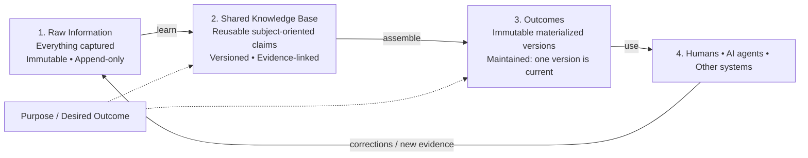
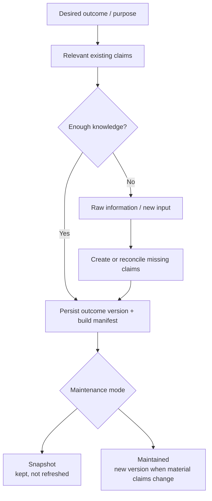

# Product Vision: Purpose-Driven Personal AI

**Working title:** Purpose-Driven Personal AI
**Document type:** Product Vision
**Status:** Early concept / foundation for product discovery
**Version:** v4 — explicit version history and simplified storage
**Original:** August 28, 2026
**Revised:** September 2, 2026

---

## Changelog — what changed in v4

The core thesis is unchanged: purpose, not volume, is the organizing principle. v4 simplifies persistence and history management while making version semantics explicit for both claims and maintained outcomes.

| Change | Section |
|---|---|
| Removed **Git** as a required system dependency; durable history and causality are explicit database responsibilities | §10, §21, §29 |
| Removed the requirement that the database be reconstructable from files/object storage; the database is now a **first-class durable store** that is backed up and migrated normally | §10 |
| Replaced the physical "files + Git + database" substrate with **object storage + database**, keeping the content store abstract so local files, S3, Azure Blob, GCS, or equivalent storage can be used | §10, §17 |
| Made outcome versioning explicit: **maintained outcomes create immutable versions and have one current version**; snapshot outcomes remain fixed | §6, §7, §8, §21–§23 |
| Added **Change Record** as a first-class history/audit concept carrying what changed, why, when, who/what made the change, the trigger, and affected versions | §10.2, §21 |
| Preserved full historical traceability without Git: old claim/outcome versions remain stored and the database records supersession, lineage, approvals, and causality | §7, §10, §13, §29 |

---

## 1. Vision

Build a personal AI system that stays meaningfully synchronized with a human—not by trying to remember everything equally, but by organizing knowledge around the outcomes the human is trying to achieve.

The long-term vision is a **human–AI working relationship** in which:

- AI performs most of the information processing, drafting, analysis, coordination, and other heavy lifting.
- Humans remain responsible for intent, judgment, priorities, values, and important decisions.
- The AI continuously understands enough of the human's goals, work, experiences, and context to act as an effective extension of that person.
- Keeping the AI informed requires relatively little effort from the human.

The knowledge base underneath that relationship should be **consumer-agnostic**. It is shared working knowledge that can be used by a human, one or more AI agents, another software system, or any combination of them. The knowledge base should maintain what is useful and trustworthy without coupling itself to who ultimately consumes an outcome.

The product should feel less like repeatedly giving instructions to a generic chatbot and more like working with a trusted collaborator that understands **what you are trying to accomplish, what has happened so far, what matters, and what it should do next**.

---

## 2. Core Thesis

The future of knowledge work will be based on **human–AI collaboration**.

AI will increasingly perform the majority of the mechanical and cognitive heavy lifting, but complete automation is neither necessary nor desirable for many important forms of work.

Humans will continue to contribute the parts that matter most:

- defining what they want;
- choosing goals and priorities;
- supplying real-world context;
- applying judgment;
- resolving ambiguity;
- making important decisions;
- accepting responsibility for outcomes.

This changes the role of the human.

Instead of doing 100% of the work, a person may eventually perform only a small portion of the total effort while AI performs the rest. But that remaining human contribution may be the most important part because it determines **direction and judgment**.

Therefore, one of the central product problems of the AI era is:

> **How do we keep the human mind and the AI's working context sufficiently synchronized so that they can operate as one effective system?**

---

## 3. The Problem

Today's AI is already highly capable, but capability alone is not enough.

An AI can only be useful when it has the right context.

Much of the context that matters lives outside the AI:

- in the human's head;
- in conversations;
- in meetings;
- in documents;
- in decisions made weeks or months ago;
- in observations from the physical world;
- in unfinished thoughts;
- in changing priorities;
- in accumulated experience.

As a result, people repeatedly have to explain themselves to AI systems.

They must keep telling the AI:

- what they are working on;
- what happened earlier;
- what they care about;
- what constraints exist;
- what decisions were already made;
- what changed;
- what they want next.

This creates a fundamental bottleneck.

### The personalization paradox

The more an AI knows about a person, the more useful it can become.

But collecting, organizing, and maintaining that information takes time.

Most people do not have the time or desire to continuously curate a perfect personal knowledge system. They have jobs, families, projects, meetings, and lives.

A useful personal AI therefore cannot depend on the user becoming a full-time curator of their own data.

---

## 4. Why Existing Approaches Are Incomplete

Many current approaches to AI memory and "second brain" systems focus primarily on **collecting more information**.

Examples include:

- saving every document;
- recording every meeting;
- storing every conversation;
- capturing notes throughout the day;
- continuously recording audio;
- maintaining large collections of Markdown files;
- indexing everything with embeddings;
- putting a RAG layer over the resulting corpus.

These approaches can improve recall, but they do not solve the whole problem.

### More memory is not automatically more intelligence

A giant collection of information can become a **data lake**:

> a large repository containing potentially useful information without a strong guarantee that the information has been organized for a particular outcome.

The problem is not that the data lake is bad.

The problem is expecting the data lake itself to be the personalized intelligence layer.

If everything is stored with equal importance, then:

- relevant information competes with irrelevant information;
- retrieval depends heavily on search quality;
- old information may conflict with current information;
- important decisions are buried among low-value details;
- the user still needs to reconstruct context;
- the AI may retrieve something semantically similar but operationally irrelevant.

A better retrieval algorithm alone does not fully solve this problem.

---

## 5. Core Insight: Purpose Comes Before Useful Memory

The missing organizing principle is **purpose**.

A personal knowledge system becomes dramatically more useful when it knows:

> **What is this knowledge supposed to help the human accomplish?**

Instead of building one undifferentiated memory of everything, the system should organize knowledge around a small number of explicit goals.

Ideally, a goal-oriented knowledge space has:

- **one primary goal**, or
- at most a very small number of closely related goals.

Examples:

- Launch my product and get the first 20 paying customers.
- Help me successfully lead Project X.
- Help me manage and improve my personal finances.
- Help me learn enough about a professional field to become highly competent.
- Help me prepare my child for school.
- Help me write and publish a book.

The goal becomes the organizing function for memory.

It tells the AI:

- what information matters;
- what can be ignored;
- what should be summarized;
- what should be tracked over time;
- what relationships should be extracted;
- what contradictions should be resolved;
- what changes are significant;
- what the AI should proactively help with.

### Key principle

> **Capture can be broad. Understanding must be purpose-driven.**

This principle is refined in §6.2 once the knowledge and outcome layers are separated: capture is broad, *retention* is demand-driven, and *assembly* is purpose-driven.

---

## 6. The Three-Layer Knowledge Model

Earlier versions of this vision described two layers: a raw information lake and a purpose-driven knowledge layer.

That model conflates two things that behave differently:

- **what is currently known about a subject**, and
- **what needs to be assembled for a particular outcome**.

These have different lifetimes, granularity, and correctness criteria. Knowledge about a subject should outlive any one use of it. An outcome is a purpose-specific view over that knowledge.

The model is therefore split into three layers.

---

### Layer 1 — Raw Information Lake

Intentionally permissive, immutable, append-only.

The user should be able to put information into the system without deciding where it belongs or how it should be organized.

Possible inputs include:

- conversations with the AI;
- voice notes;
- meeting transcripts;
- emails;
- documents;
- screenshots;
- web pages;
- notes;
- calendar events;
- messages;
- observations;
- photos;
- tasks;
- decisions;
- imported application data;
- automatically captured information;
- **corrections, decisions, and evidence produced anywhere else in the human–AI system**.

The philosophy is:

> **If the user thinks something might matter, make it easy to capture it.**

Some information in this layer will never become useful. That is acceptable.

Immutability is not a stylistic preference. It preserves the original evidence so extraction and reconciliation logic can improve later without losing or rewriting what actually entered the system.

---

### Layer 2 — Knowledge

Raw information is filtered, extracted, reconciled, and maintained as **knowledge organized by subject or topic**.

Each knowledge item is a **claim**: typed, named, versioned, and linked to the evidence that supports it.

The knowledge layer answers: *what is currently true, and currently believed, about this subject?*

It is deliberately **not** a summary of the raw layer. It is a continuously maintained current-best-understanding, in which new information can confirm, update, supersede, contradict, or add nuance to what is already held.

The knowledge layer is a **shared substrate**. It does not need to know whether the next use will be by a human, an AI agent, another application, or a human–AI team. Its responsibility is to maintain reusable knowledge and provenance.

---

### Layer 3 — Outcomes

Knowledge is assembled to serve a **very specific outcome**.

An outcome can be a deliverable, answer, decision package, monitored state, draft, plan, report, machine-readable context package, or other purpose-specific view. The eventual consumer may be a human, an AI agent, another system, or some combination of them.

**Every outcome is persisted, and every materialized outcome version is immutable.** Outcomes differ only in whether later signals can create a newer version:

- **Snapshot outcome** — one stored immutable version, with its build manifest; later signals do not refresh it.
- **Maintained outcome** — a logical outcome with an immutable version history. When a bound claim changes materially, regeneration creates a **new outcome version** and that version becomes current; older versions remain preserved.

This means an ad-hoc request is not disposable. It becomes a durable snapshot of what was needed and what the system produced at that moment. Maintained outcomes additionally preserve how that result evolved over time.

---

### 6.1 Outcomes are derived views, not canonical knowledge

The cleanest way to understand the model is:

> **Two canonical storage layers and one derived view layer.**

Raw and Knowledge are canonical stores. Outcomes are derived views over Knowledge. All outcome versions are persisted as artifacts, but only maintained outcomes participate in incremental refresh. A maintained logical outcome may therefore have many immutable materialized versions, with one version designated as current.

This removes the need for a promotion lifecycle:

- A snapshot and a maintained outcome are produced through the same mechanism.
- Both bind to claims and carry manifests.
- The only difference is the **maintenance policy**.
- Changing a snapshot into a maintained outcome means changing its maintenance mode; future refreshes create new versions rather than rewriting the original materialization.

Persisting outcome views also provides **pre-computed context-window packing** for reasoners with limited context budgets.

---

### 6.2 Subject-oriented storage, demand-driven inclusion

Organizing the knowledge layer by topic rather than by goal is deliberate.

**Why topic, not goal:** goal-scoped knowledge does not survive goal completion. Subject-oriented knowledge outlives the outcomes it served and can be reused by later goals.

**What that costs:** topic relevance is broad. Left alone, the knowledge layer could drift into being a second data lake.

**The fix:** make inclusion strictly **demand-driven**. A claim earns a place in the active knowledge layer because at least one stored outcome actually depends on it.

- **Topic decides where a claim lives.**
- **Outcomes demonstrate why the claim needs to exist.**

A stable active claim with no outcome dependency is therefore a contradiction in the model. When a new outcome requires knowledge that is missing, the system may consult raw sources, derive the needed claim, persist the claim and its lineage, and bind the new outcome to it as part of the same outcome-building operation.

Purpose remains the parameter that shapes both transforms: it determines what must be learned from raw information for the current need, and what subset of knowledge must be assembled into the outcome.

> **Capture can be broad. Retention must be demonstrated by use. Assembly must be purpose-driven.**

---

### 6.3 Structural relationships

Ownership and outcome dependency must be separated.

**Ownership is strict.**

- One raw layer supports many topics in the knowledge layer.
- Every knowledge claim has **exactly one owning topic**.

Single ownership means reconciliation has exactly one home. Without it, the same claim can drift independently across topics and there is no authoritative current version.

**Outcome dependency is many-to-many.**

- One outcome may bind to claims from any number of topics.
- One claim may support any number of outcomes.

Real outcomes cut across subjects. A board-review brief may need project knowledge, financial knowledge, and knowledge about the people involved. The knowledge layer does not care whether that brief will be consumed by a person or by an agent; it only records the facts the outcome depends on.

In database terms: **topic is the ownership/partition boundary; outcome bindings are dependency edges.**

---

### 6.4 Support count: demonstrated reuse without promotion

Every named claim has a derived **support count**:

> **support_count = number of distinct stored outcomes that depend on the claim**

Snapshot and maintained outcomes contribute equally. The count is derived from persisted outcome bindings, so it can be recalculated when needed or cached as database metadata rather than treated as an independent fact.

Support count is useful because it measures demonstrated reuse without introducing candidate claims, promotion thresholds, or separate claim lifecycles.

However, support count must **not** become the primary retrieval rule. A popular claim can still be irrelevant to a new problem.

The ordering principle is:

1. **Relevance to the desired outcome first.**
2. **Support count as a secondary priority signal** among otherwise relevant claims.

A higher support count means a claim has proven useful across more outcomes and is therefore worth considering earlier, not that it is automatically relevant.

## 7. Layer Contracts

If outcomes re-read whole topic representations, then any change to how knowledge is represented invalidates everything downstream. The seam between Layer 2 and Layer 3 needs a contract.

### 7.1 Facts are the interface

The knowledge layer exposes **named, typed, addressable claims**. Outcomes bind to those names.

An outcome does not say "read the Project X topic." It says "I depend on facts `project-x.current-scope`, `project-x.committed-date`, `people.sponsor.identity`."

This buys three things:

1. **Targeted invalidation.** When a fact changes, exactly the maintained outcomes bound to that fact can become stale. Snapshot outcomes remain unchanged historical artifacts.
2. **Computable blast radius.** The number of maintained outcomes affected by a fact change is known, which makes review tiering possible (§13).
3. **Representation freedom.** How a topic is internally represented can change without breaking downstream views, as long as the named facts still resolve.

This is the same pattern as a data contract between a producer and downstream dependency, applied to knowledge rather than tables.

### 7.2 Claim versions are superseded, never overwritten

A named logical claim may have multiple immutable versions. The database designates the current version and preserves the supersession chain. Each claim version records:

- the evidence it derives from;
- when it became current;
- when it stopped being current;
- what replaced it, and on what evidence.

This is a slowly changing dimension in the classical sense, and the decades of practice around that pattern apply directly.

The property it buys is the one that matters most for trust: **"why did this outcome change?" is answerable**, and any historical outcome can be reproduced exactly from the claim versions it was built from.

### 7.3 Outcomes are versioned and every version carries a build manifest

Every materialized outcome version — snapshot or maintained — records the specific claim versions it was assembled from.

A **snapshot outcome** normally has one immutable version. Its manifest makes the historical result reproducible and explains what the system knew at that moment.

A **maintained outcome** is a logical outcome with a version history. Each material regeneration creates a new immutable outcome version with its own build manifest. The database records which version is current and how each version supersedes the previous one. Older versions are never overwritten.

This makes regeneration a diff between two explicit builds rather than a mystery and makes questions such as *what did this outcome say before, what changed, and why?* directly answerable.

Because bindings are persisted in the database, claim support counts can be calculated from them without introducing a second independent source of truth.

## 8. Propagation and Incremental Maintenance

Both outcome modes use the same knowledge path.

**Path A — maintained outcome.** Assemble from claims, persist an immutable outcome version and manifest, designate it current, then monitor its bound claims. New raw information may update those claims; material changes can mark the outcome stale and trigger regeneration into a new immutable version.

**Path B — snapshot outcome.** Assemble from claims and persist one immutable outcome version and manifest, but do not refresh it when later signals arrive.

The difference is therefore not how an outcome obtains knowledge. The difference is only whether it participates in future maintenance.

---

### 8.1 Lineage in both hops

The system must record which raw items support which claim, and which claims feed which outcome.

Without lineage, every new input forces broad recomputation. That is expensive, and worse, it is **nondeterministic**: re-derivation can drift, so an unchanged source may produce a changed result and trust erodes.

---

### 8.2 Materiality, not immediate recompute

Not every claim update should trigger a new maintained-outcome version.

The sequence should be: claim changes → find bound **maintained** outcomes → mark potentially stale → let something cheap decide whether the change is **material** to each outcome → generate a new version only when needed.

Regeneration should create a **new immutable outcome version** and surface a diff with the triggering evidence attached. The previous current version remains preserved in history.

Snapshot outcomes never enter this maintenance path. Their single stored version remains exactly as produced, even when the underlying knowledge later changes.

Whether regeneration is automatic or gated on review remains a **per-outcome property**, not a system-wide policy.

---

### 8.3 The reverse edge

The most valuable learning signal is an authoritative correction, decision, or real-world result produced at the outcome boundary — often from a human, but potentially supplied through another trusted participant in the system.

If a correction lives only in the outcome, the same error can recur next time.

Corrections must therefore flow **upward**:

1. The correction lands in the raw layer as a source — it is new evidence about the world or about the user's intent.
2. It updates or supersedes the claim in the knowledge layer that produced the error.
3. Bound maintained outcomes are reconsidered; snapshot outcomes remain historical records.

An architecture with only downward arrows cannot learn from outcomes.

---

### 8.4 Every outcome is a demand signal

Because every outcome is persisted, the system has a durable record of what knowledge was actually needed.

Each outcome contributes bindings to the claims that supported it. Those bindings naturally update each claim's **support count**.

This replaces promotion logic with something simpler:

- there is only one kind of claim;
- snapshot and maintained outcomes both demonstrate demand;
- reuse emerges from the binding graph rather than a hard threshold;
- frequently reused claims become easier to prioritize for future relevant outcomes.

No global promotion threshold is required.

---

### 8.5 The escape hatch becomes a gap-filling path

Raw→knowledge is lossy. The current knowledge layer will eventually be insufficient for some desired outcome.

The system therefore needs an escape hatch to raw information, but that escape hatch should preserve the rule that **outcomes ultimately depend on claims**.

When outcome construction cannot find enough relevant knowledge:

1. search or inspect raw sources;
2. derive the missing information;
3. create or reconcile normal claims in the knowledge layer;
4. record source→claim lineage;
5. bind the outcome to those claims;
6. persist the outcome and its manifest.

This is a **knowledge gap resolution path**, not a parallel path that bypasses the knowledge layer forever.

The result is important: snapshot and maintained outcomes use the same internal mechanism. New problems can enrich the shared knowledge base even when the resulting outcome will never be maintained.

---

### 8.6 Idempotency has to live in storage

In a deterministic pipeline, idempotency comes from transform purity: the same input produces the same output, so re-running is safe.

That guarantee does not exist here.

Idempotency must be enforced at the **storage layer** instead — content-addressed keys, stable claim slots, or equivalent controls so that the same source producing the same fact does not create a second competing current claim.

## 9. Relationship to Data Engineering

This system and a data platform both collect, store, and process information in order to serve goals. Decades of data engineering practice are therefore relevant, and the project should borrow deliberately rather than by accident.

But the differences have to be **load-bearing**. A statement that "our data is unstructured and our process is nondeterministic" is philosophy; it constrains nothing. Each difference below ends in a design decision it forces.

---

### 9.1 Borrow directly

**Immutable raw plus reprocessing optionality.** Most AI memory systems treat memory as one mutable store, which means an improved extractor can no longer inspect the original evidence. Keeping raw immutable preserves the option to revisit extraction or reconciliation later without making reprocessing a normal operating requirement.

**Slowly changing dimensions.** The supersession requirement in §7.2 is exactly SCD Type 2.

**Conformed dimensions as a shared entity registry.** People, organizations, and projects appear across many topics. Resolving them once, centrally, stops the same person existing as three entities in three topic representations. The entity-resolution problem is identical.

**Data contracts.** §7.1 is a data contract applied to knowledge.

**Freshness as an explicit per-view property.** Maps onto per-outcome regeneration policy.

---

### 9.2 Borrow, but invert

**The ETL/ELT instinct.** In a data platform the pipeline is the asset and tables are derived, so "just re-run it" is always available. Here the transform costs money and can produce a different answer each time. That inverts the relationship: **the derived knowledge artifact is an asset to preserve and version, not a cache to recompute**. Large-scale reprocessing of knowledge is therefore a deliberate migration event with human review, closer to a schema change than a nightly job.

**Data quality testing.** You cannot assert that an extracted claim is correct. You can assert **structural invariants**: every claim resolves to evidence; every evidence pointer is live; no two current claims occupy the same slot with contradictory values; every fact an outcome binds to exists. Correctness testing moves to sampling and human review — which is precisely what the AI-suggests / human-approves pattern is for.

---

### 9.3 Do not borrow

**A global schema or ontology defined up front.** Warehouses can conform globally because the question set is bounded and stable. Here, schema should emerge per topic and be allowed to differ across topics, with conformance only at the shared-entity boundary.

**Pipeline-centric architecture.** In data engineering the pipeline is the primary artifact and data flows through it. Here the **knowledge artifact is primary** and processing is opportunistic. Building an orchestration and scheduling layer would import complexity this system does not need.

**Completeness.** Warehouses aim for exhaustive coverage where the totals tie out. This system explicitly does not (§28). Completeness thinking is the gravitational pull that drags the knowledge layer back into being a second data lake.

**Data Mesh.** It solves an organizational problem that does not exist at single-user scale. Revisit only if the system becomes multi-writer.

---

### 9.4 The differences that force design decisions

**One important downstream consumer is a reasoner under a context budget, not a query engine.** A warehouse answers "can this question be answered." When an outcome is assembled for an AI reasoner, the system must also answer "does the right subset fit." Selection and compression therefore become first-class architectural concerns. This is one justification for keeping compact, persisted outcome views rather than repeatedly reconstructing context from scratch; human and software consumers can use the same views without changing the knowledge model.

**Truth is contested, not merely late-arriving.** In a warehouse, disagreement between sources is a data quality bug. Here, two sources can legitimately disagree and the user can change their mind. **Contradiction is a representable state**, not an error condition.

**The human is an input channel.** No warehouse can ask a question. The cheapest way to resolve ambiguity here is to ask the user, which means the system needs a **question queue prioritized by value of information** — designed deliberately, not left to emerge as ad hoc chat.

**Volume is tiny.** Thousands of claims, not billions of rows. A large share of data engineering technique exists purely to survive scale and is pure overhead here. Full graph traversal, expensive per-item processing, and per-item human review are all affordable. **Small-N is a design advantage to spend, not a limitation to work around.**

**The process is nondeterministic.** Re-running the same extraction on the same input does not reproduce the same output, which is why lineage, caching, and storage-level idempotency carry the weight that transform purity carries elsewhere.

---

### 9.5 The inversion, in one line

> Data engineering treats the **pipeline** as the asset, reprocessing as **cheap**, and **completeness** as the goal.
>
> This system treats the **knowledge artifact** as the asset, reprocessing as **expensive and lossy**, and **sufficiency** as the goal.

---

## 10. Storage and History Substrate

The system uses two durable storage responsibilities:

- **Object storage** holds content: raw source objects, immutable claim-version content, immutable outcome-version content, and other large or format-specific artifacts. "Object storage" is an abstraction, not a commitment to one vendor or filesystem. An implementation may begin with local files and later use S3, Azure Blob, Google Cloud Storage, or an equivalent store without changing the knowledge model.
- **A database** is a first-class durable system of record for metadata and relationships: logical object identities, version relationships, current-version pointers, source→claim lineage, claim→outcome bindings, topic ownership, authorship, timestamps, approvals, change history, support counts or caches, retrieval metadata, and other structured state.

The object store and database are both canonical, but for different responsibilities. The design does **not** require the database to be reconstructable from object storage. Production reliability comes from normal database backup, restore, migration, replication, and disaster-recovery practices.

Object-store metadata may be used for small infrastructure hints such as content type, schema version, object ID, or checksum, but it is not expected to carry the complete knowledge graph or audit history. Rich metadata and relationships belong in the database.

### 10.1 Immutable content, durable structured state

Historical content versions are preserved rather than overwritten:

- raw sources are append-only;
- claim updates create new claim versions and preserve superseded versions;
- maintained-outcome refreshes create new outcome versions and preserve prior versions;
- snapshot outcomes remain fixed as produced.

The database records which claim and maintained-outcome versions are current. It also records validity and supersession relationships so the system can answer historical questions without relying on storage-system versioning semantics.

This means the architecture does not depend on Git, S3 Versioning, or any specific blob-store history mechanism for domain history. Storage-provider versioning may still be enabled operationally, but the KB's history is represented explicitly in its own data model.

### 10.2 Change Records carry causality

Version history alone says **what** changed. Trust also requires knowing **why** it changed.

The database therefore stores a first-class **Change Record** for meaningful KB mutations. A change record should capture enough information to explain the causal event, including:

- what changed;
- previous and new version references where applicable;
- why the change was made;
- the triggering source, correction, decision, or process;
- who or what made or approved the change;
- when it happened;
- which claims, outcomes, topics, or other objects were affected.

One change record may group multiple related version changes produced by the same causal event. For example, a new source may supersede one claim and cause three maintained outcomes to generate new versions; those mutations can share one change ID.

This replaces the useful semantic role previously assigned to Git commits without making Git a technology dependency. The database can directly answer questions such as *what did I believe on this date?*, *what changed since then?*, and *why did this outcome change?* by combining version history, lineage, and change records.

## 11. The Product's Core Loop

The product should operate as a continuous loop.

### 1. Define the goal

The human establishes the purpose of the knowledge space.

The system helps clarify:

- the desired outcome;
- why it matters;
- success criteria;
- major constraints;
- time horizon;
- current state.

The user should not need to perfectly define the goal on day one. The goal can evolve.

### 2. Capture information

The user provides information with very low friction.

Capture should be easier than organization.

The system may also connect to existing sources—with user permission—to reduce manual entry.

### 3. Interpret

AI evaluates incoming information in the context of the goal.

### 4. Extract knowledge

The system identifies durable, useful knowledge such as:

- facts;
- people;
- entities;
- decisions;
- constraints;
- preferences;
- commitments;
- plans;
- milestones;
- risks;
- lessons;
- unresolved questions;
- hypotheses;
- dependencies.

### 5. Reconcile with existing knowledge

New information may:

- confirm something;
- update something;
- supersede something;
- contradict something;
- add nuance;
- create uncertainty.

The system should maintain the current best understanding rather than simply accumulating statements forever.

### 6. Maintain the goal model

The purpose-driven layer continuously represents:

- where the user is now;
- where the user wants to go;
- what is known;
- what is unknown;
- what has been decided;
- what is blocked;
- what needs attention;
- what may happen next.

### 7. Help the human act

The AI uses this model to:

- answer questions;
- draft work;
- prepare decisions;
- identify missing information;
- suggest next steps;
- perform delegated tasks;
- monitor progress;
- surface risks;
- coordinate work;
- prepare the human for important judgment calls.

### 8. Learn from outcomes

Human decisions and real-world results update the knowledge model.

Corrections do not stop at the outcome. A correction enters the raw layer as a source, supersedes the claim that produced the error, and marks every other outcome bound to that claim as stale (§8.3).

The system becomes more useful over time.

---

## 12. Human–AI Division of Responsibility

The product should not be designed around the assumption that AI replaces the human.

It should be designed around **division of cognitive labour**.

### Human

The human primarily provides:

- goals;
- values;
- judgment;
- preferences;
- corrections;
- real-world observations;
- decisions;
- responsibility.

### AI

The AI primarily performs:

- information capture;
- organization;
- extraction;
- synthesis;
- recall;
- comparison;
- drafting;
- analysis;
- planning;
- tracking;
- monitoring;
- execution of delegated work.

The objective is to minimize the amount of repetitive cognitive labour required from the human while preserving human control over what matters.

---

## 13. Human Review: Tier by Blast Radius

The system should apply the pattern of **AI does the work, human reviews the important decisions** wherever it applies. That pattern substitutes for deterministic data-quality gates where judgment is required.

But applied uniformly, it fails.

Review requests scale with input volume. At any real ingestion rate, the review queue becomes the new job — exactly the failure mode named in *minimize synchronization cost*.

### 13.1 Reuse and blast radius are different numbers

A claim's **support count** measures how many stored outcomes have used it. It is a reuse signal.

A claim change's **blast radius** measures how many **maintained outcomes** may need reconsideration if that claim changes. Snapshot outcomes do not regenerate, so they contribute to support count but not to maintenance blast radius.

Keeping those concepts separate prevents a heavily reused historical fact from automatically creating a large review burden.

### 13.2 Tiering

| Change | Handling |
|---|---|
| New claim introduced for a new outcome; narrow and reversible | Apply, optionally flag for later review |
| Change to a claim with no maintained outcomes depending on it | Apply, preserve provenance; snapshots remain unchanged |
| Change affecting a small number of maintained outcomes, reversible | Apply, flag for later review |
| Change affecting many maintained outcomes | Queue for approval before applying |
| Topic boundary creation or merge | Queue for approval |
| Knowledge-layer bulk migration or schema change | Explicit migration, always reviewed |
| Contradiction the system cannot resolve | Queue as a question, prioritized by value of information |

There should not normally be an active **new claim with zero outcome dependencies**. Claims are created because an outcome demonstrated the need for them (§6.2).

### 13.3 Two distinct modes

**Approve before applying** and **apply, then flag for review** are different modes.

Because immutable versions and database change records make most KB changes traceable and reversible, the second mode is available far more often than instinct suggests and preserves flow. Reserve pre-approval for changes that are hard to reverse, uncertain in a consequential way, or wide in blast radius.

### 13.4 Batch, don't interrupt

Review should be a periodic pass over a queue, not an interruption of the user's work. The queue itself should be ordered by consequence, so that if the user only reads the top of it, they still see the decisions that matter most.

## 14. A New Definition of a "Second Brain"

Traditional second-brain systems often behave like better filing cabinets.

This product should behave more like a **goal-oriented cognitive partner**.

A useful second brain should not merely remember.

It should understand:

1. **What am I trying to accomplish?**
2. **What do I currently know that matters to that goal?**
3. **What has changed?**
4. **What have I already decided?**
5. **What remains uncertain?**
6. **What should I pay attention to now?**
7. **What can the AI do for me?**
8. **Where is human judgment required?**

The second brain therefore becomes a bridge between **memory and agency**.

---

## 15. Product Promise

The product's promise can be expressed simply:

> **Tell the AI what matters to you, keep it lightly informed about your world, and it will continuously organize what it knows around your goal so it can do more of the work for you.**

The user should not need to spend hours maintaining the system.

A reasonable aspiration is that a person could spend perhaps **tens of minutes per day—or less—synchronizing important real-world context**, while receiving many hours of leveraged AI assistance.

Over time, integrations and passive capture should reduce even that effort.

---

## 16. Core Product Principles

### 16.1 Purpose before organization

Do not ask the user to design folders, ontologies, schemas, or taxonomies before the system becomes useful.

Start with the goal.

### 16.2 Capture first, structure later

Make input friction extremely low.

Let AI do most of the organization.

### 16.3 Raw memory and useful knowledge are different things

Never treat the complete information archive as the AI's working memory.

### 16.4 Relevance is goal-dependent

The same piece of information may be essential for one goal and irrelevant for another.

### 16.5 Memory should evolve

The system should maintain current understanding, not merely append facts forever.

### 16.6 Humans remain in control

AI should know when it can act and when human judgment is required.

### 16.7 Minimize synchronization cost

The system fails if keeping it informed becomes another job.

### 16.8 Preserve provenance

Important knowledge should retain a connection to where it came from so the human can inspect evidence when needed.

### 16.9 Separate facts from interpretations

The system should distinguish source information from AI-generated conclusions.

### 16.10 Make uncertainty visible

When the AI is unsure, conflicting information exists, or critical information is missing, that uncertainty should be explicit.

### 16.11 Retention is demand-driven

Knowledge earns its place because an outcome needs it, not because it is interesting or because it was easy to extract.

### 16.12 Subject-oriented storage, purpose-driven assembly

Knowledge is organized by topic so that it outlives the goals it served. Purpose enters as a filter on what to keep and a specification for what to assemble.

### 16.13 Derived knowledge is an asset, not a cache

Re-derivation is expensive and nondeterministic. Knowledge is preserved and versioned, not regenerated on a whim.

### 16.14 Corrections must travel upward

A fix applied only to an outcome will be undone the next time that outcome regenerates.

### 16.15 Review scales with consequence, not with volume

Human attention is spent on decisions that are wide or hard to reverse. Everything else is applied and made reversible.

### 16.16 Knowledge is consumer-agnostic

The knowledge layer maintains reusable claims and evidence. It should not encode whether the next consumer is a human, an AI agent, or another system.

### 16.17 Outcome persistence and maintenance are separate concerns

Every materialized outcome version is retained as a snapshot of work performed. Maintenance is an explicit policy layered on top: snapshot outcomes stay fixed; maintained outcomes create new immutable versions when refreshed, with one version designated current.

### 16.18 Reuse should emerge from bindings, not promotion thresholds

Claims have one lifecycle. Their support count is derived from how many stored outcomes depend on them; relevance remains the primary criterion for future use.

### 16.19 History is explicit domain data

Version relationships, causality, approvals, and change reasons belong to the KB's own data model. They should not depend on Git commits or storage-provider version history.

### 16.20 Storage technology should remain replaceable

The knowledge model should depend on an object-storage abstraction rather than a local filesystem or a specific cloud provider. Structured metadata and relationships belong in the durable database.

---

## 17. Conceptual Architecture

The architecture is intentionally simple at the highest level:

The important separation is:

- **Raw Information** preserves what entered the system.
- **Shared Knowledge** maintains the current best understanding as reusable claims.
- **Outcomes** package subsets of that knowledge for a specific purpose.
- **Consumers are outside the knowledge architecture.** The same knowledge base can support humans, AI agents, and other software without changing its internal model.

If the Knowledge layer cannot support a requested outcome, outcome construction temporarily drops to Raw, derives the missing claims, records lineage, and then completes the outcome through the normal Knowledge→Outcome path.

Substrate: **object storage** for immutable/versioned content and a **durable database** for metadata, relationships, current-version pointers, lineage, change history, and retrieval. Git is not required. Support count is derived from persisted outcome bindings.

## 18. The Goal as a Function

Purpose is not metadata. It enters at two distinct decisions:

- During gap filling and raw→knowledge extraction, purpose decides **what must be learned and retained because this outcome needs it**.
- During knowledge→outcome assembly, purpose decides **which relevant claims should be included now**.

After the outcome is stored, its bindings become durable evidence of demand. Those bindings contribute to claim support counts whether the outcome is a snapshot or maintained.

## 19. Example

Imagine a user creates a knowledge space with the goal:

> **Launch my new SaaS product and acquire 20 paying customers within six months.**

During the next several months, the user adds:

- customer interviews;
- competitor links;
- random ideas;
- meeting recordings;
- pricing discussions;
- technical architecture notes;
- emails;
- sales conversations;
- personal observations;
- product metrics;
- investor articles;
- unrelated documents.

All of this can enter the raw information layer.

The purpose-driven layer may extract and maintain:

### Goal

20 paying customers within six months.

### Current strategy

Target small accounting firms with a specific workflow problem.

### Important hypotheses

- Customers will pay $X/month.
- Setup time must remain below Y.
- Accuracy is the primary purchasing criterion.

### Decisions

- Initial market chosen.
- Feature A postponed.
- Pricing changed after interview #8.

### Evidence

- 6 of 9 interviews mentioned the same pain point.
- Three prospects requested a demo.
- One prospect rejected the current price.

### Risks

- Onboarding remains too technical.
- Acquisition channel is unproven.

### Open questions

- Which buyer persona has budget authority?
- Does annual pricing improve conversion?

### Next actions

- Follow up with three prospects.
- Test revised pricing.
- Simplify onboarding.

A random article about an unrelated topic can remain safely in the raw layer.

It does not need to become part of the goal model.

This is the difference between **remembering everything** and **knowing what matters**.

---

## 20. Differentiation

The product is not primarily differentiated by:

- having a chatbot;
- storing documents;
- vector search;
- RAG;
- transcription;
- note taking;
- a large context window;
- long-term memory by itself.

Those capabilities may all be components.

The differentiation is the system's ability to maintain a **purpose-shaped model of the user's world**.

### Traditional memory-centric approach

> "Remember as much about me as possible."

### Purpose-driven approach

> "Understand what I am trying to accomplish, then continuously determine what you need to know in order to help me accomplish it."

That is a fundamentally different optimization target.

---

## 21. Potential Core Objects

The first implementation does not need a complex ontology, but several concepts are likely to be important.

### Goal

The purpose or result the human–AI system is trying to achieve.

### Source

Raw information entering the system.

### Knowledge Item

A structured piece of purpose-relevant understanding.

Possible types:

- fact;
- decision;
- preference;
- constraint;
- observation;
- assumption;
- hypothesis;
- task;
- risk;
- opportunity;
- milestone;
- question;
- lesson.

### Entity

A meaningful person, organization, project, product, place, concept, or other object relevant to one or more outcomes.

### Relationship

A meaningful connection among entities or knowledge items.

### Evidence

Source material supporting a knowledge item.

### State

The system's current understanding of progress or conditions relevant to a purpose.

### Action

Something a human, AI agent, or other system may need to do.

### Topic

The subject that owns a set of knowledge claims. Emergent rather than pre-designed: AI may propose boundaries and humans can review consequential changes. Every active claim belongs to exactly one topic.

### Claim

A named logical unit of the knowledge layer, typed and owned by one topic. A claim may have multiple immutable versions, with one version designated current when the claim has a resolved current belief.

A claim exists in the active knowledge layer because at least one stored outcome depends on it.

### Claim Version

An immutable evidence-linked materialization of a claim at a point in time. New evidence may confirm the current version or cause a new version to supersede it. Superseded versions remain preserved with their validity period, evidence, and change record.

### Support Count

A derived property of a named claim: the number of distinct stored outcomes whose bindings depend on that claim. Snapshot and maintained outcomes both count. It is a secondary reuse/ranking signal, not a promotion threshold and not a substitute for relevance.

### Outcome

A logical persisted view over knowledge serving one specific purpose.

Every outcome has a maintenance mode:

- **snapshot** — normally has one immutable materialized version and is never automatically refreshed;
- **maintained** — may have many immutable materialized versions and is reconsidered when bound claims change. Exactly one version is designated current.

The consumer is not part of the outcome model; it may be a human, AI agent, other system, or combination.

### Binding

The declared dependency from an outcome to the named claims it needs. Bindings are the unit of provenance, support-count calculation, and targeted invalidation.

### Outcome Version

An immutable materialization of an outcome at a particular point in time. It records the content produced, its build manifest, creation time, and supersession relationship when another version replaces it as current.

### Build Manifest

The exact claim versions used to produce an outcome version. Every materialized outcome version has one.

### Change Record

A durable database record explaining a meaningful KB change: what changed, why, when, who or what caused or approved it, the triggering evidence or decision, and the affected old/new versions. A single change record may group several related mutations under one causal event.

### Lineage

The recorded edges from raw source to claim, and from claim to outcome. Without lineage there is no targeted invalidation, provenance, reproducibility, or honest answer to why something changed.

### Gap

A recorded instance of the current knowledge layer failing to supply what a desired outcome needed. Resolving a gap produces or updates normal claims rather than creating a separate candidate-claim lifecycle.

## 22. An Important Architectural Distinction

The system should maintain at least three different forms of information:

### 1. Source memory

What actually entered the system.

This should remain relatively immutable.

### 2. Derived knowledge

What the system currently believes is useful and true based on sources and demonstrated outcome demand.

This may change through supersession and reconciliation.

### 3. Working context

The subset of derived knowledge assembled for a specific outcome at a specific moment.

This distinction prevents the system from treating every historical statement as equally current and equally relevant.

### How this maps onto the three layers

| Form | Where it lives |
|---|---|
| Source memory | Layer 1, immutable |
| Derived knowledge | Layer 2, superseded over time |
| Working context | Layer 3 as a persisted outcome with a build manifest |

A **snapshot outcome** preserves working context exactly as it was assembled. A **maintained outcome** preserves every materialized version of that working context and designates one version as current; relevant material claim changes may generate a new current version without deleting the prior one.

## 23. MVP Hypothesis

The first version should prove one central hypothesis:

> **A purpose-driven knowledge layer can make a personal AI meaningfully more useful than an AI operating directly over a large unstructured memory store.**

The MVP does not need to ingest a person's entire digital life. It can begin with one desired outcome and a few input channels.

### MVP experience

1. The user names something that needs to be produced now — the first outcome.
2. The system checks the existing knowledge layer for relevant claims.
3. If knowledge is insufficient, the user supplies context and/or the system consults available raw sources.
4. The system creates or reconciles the claims the outcome actually requires, with evidence and lineage.
5. The outcome is produced as an immutable outcome version, persisted, and bound to the exact claim versions used.
6. The user chooses whether the outcome is **snapshot** or **maintained**. The knowledge and claim lifecycle does not change.
7. Corrections and decisions flow upward as new raw evidence and may supersede claims.
8. New signals can stale only maintained outcomes; a material refresh creates a new immutable outcome version and advances the current-version pointer. Snapshot outcomes remain fixed historical artifacts.
9. Every stored outcome contributes to claim support counts, so repeated use increases demonstrated reuse naturally.
10. The system asks only high-value clarification questions, preferably batched rather than interrupting.

The goal model is elicited **through** actual outcomes rather than demanded before any useful work is done (§24).

## 24. Bootstrapping and Outcome-Level Cold Start

Cold start is not only a new-knowledge-base problem.

It occurs whenever:

> **The current knowledge layer is insufficient to support a desired outcome.**

There are therefore at least two common cases:

1. **Initial cold start** — the knowledge base is new and contains little useful knowledge.
2. **Outcome-level cold start** — the knowledge base already exists, but a new problem requires knowledge that has never been needed before.

Both cases use the same mechanism.

> **Start from the desired outcome, not from speculative knowledge collection.**

1. Ask what needs to be produced or decided now.
2. Attempt to assemble it from existing claims.
3. If knowledge is insufficient, consult raw sources and/or request the minimum additional context needed.
4. Create or reconcile the missing claims and record lineage.
5. Produce and persist the outcome with bindings to those claims.

This causes the knowledge layer to accrete **backwards from demonstrated demand**.

Two things follow:

- The first interaction around a new problem can still deliver value instead of requiring weeks of setup.
- Once the gap has been resolved, future related outcomes can reuse the newly created claims, so the same area of the knowledge base becomes progressively warmer.

A mature knowledge base can therefore still experience cold starts at its edges. That is expected, not a failure of the model.

## 25. Measuring Whether the Bet Is Working

The central bet needs numbers attached to it early.

### Primary metric — knowledge layer sufficiency rate

> What fraction of desired outcomes can be produced from the knowledge layer without needing to drop to raw sources or request new context?

If this rate does not climb within recurring problem areas, the core bet is wrong or the knowledge layer is failing to retain the right things.

### Supporting metrics

- **Correction rate on regenerated maintained outcomes** — how often a maintained outcome needs meaningful correction after refresh. Measures propagation trustworthiness.
- **Review queue volume per unit of input** — whether human-in-the-loop design is saving time or becoming the new job (§13).
- **Gap-to-claim latency** — how long it takes from discovering missing knowledge for an outcome to having the necessary claim available in the knowledge layer.
- **Knowledge reuse rate** — how often new outcomes reuse claims that already existed rather than creating entirely new ones.
- **Support-count distribution** — whether a useful core of claims is being reused across many outcomes or the knowledge layer is fragmenting into one-off facts.
- **Synchronization time per day** — the human effort required to keep important real-world context current.
- **Stale maintained-outcome ratio** — how many maintained outcomes are currently out of date relative to their bound claims. Snapshot outcomes are excluded by definition.

Support count is an explanatory signal, not a target to maximize. The system should never prefer a popular but irrelevant claim over a less-used claim that better fits the desired outcome.

## 26. What the MVP Should Not Try to Solve

Early versions should avoid becoming:

- a universal life-logging platform;
- a replacement for every note-taking application;
- a general document management system;
- a giant enterprise knowledge graph;
- an autonomous agent that acts without boundaries;
- a perfect memory of the user's entire life;
- an ontology-design product;
- a generic RAG platform;
- a workflow orchestration platform;
- a complete data warehouse for a person's life;
- a system that asks for approval on everything it does.

The early product should stay focused on proving that **purpose-driven knowledge produces better human–AI collaboration**.

---

## 27. Possible Initial Product Experience

A simple product could have several main views.

### Goal

What are we trying to accomplish?

### Knowledge

What does the shared knowledge base currently understand that matters, and which claims are most reused?

### Inbox

What new information has entered the system, and what did it change?

### Outcomes

What outcomes have been produced? Which are snapshots, which are maintained, what is stale, and what changed?

### Review

Which AI-proposed changes or unresolved contradictions deserve human judgment, ordered by consequence?

### Collaborate

What should the human and AI agents think about, decide, or do next using the shared knowledge base?

The user should be able to see the evolving shared working model rather than interacting only through a chat window.

## 28. Sync Should Be Selective, Not Exhaustive

The system does not need to know everything about a person or project.

It needs to know **enough of the right things for the outcomes that matter**.

The objective is not:

> Human Brain = AI Memory

Nor is it:

> Raw Data = Knowledge Base

The objective is closer to:

> Goal-Relevant Shared Context ≈ What the human–AI system needs to work effectively

The system should therefore optimize for **sufficient synchronization**, not complete synchronization. New outcome-level cold starts are acceptable; the important property is that resolving them leaves reusable knowledge behind.

## 29. Evolution Path to Multi-Writer

The first version is single-user. Simplicity should win. But a few decisions made now determine whether multi-writer is a later feature or a later rewrite.

**What must be true from the start:**

- **Every claim has an author and a timestamp.** Adding attribution later means backfilling something that was never recorded.
- **Every claim has exactly one owning topic.** Ownership is how concurrent writers are arbitrated; retrofitting it into a knowledge layer that grew without it is a data migration.
- **Approvals are durable change records.** Multi-writer needs a shared, auditable record of who decided what, when, and why. The database records the approval and links it to the affected versions and causal change record.
- **Contradiction is a representable state.** Single-user contradiction comes from changing your mind. Multi-writer contradiction comes from disagreement. The representation is the same; only the resolution policy differs.

**What can safely wait:**

- access control and visibility scoping;
- per-user views of shared knowledge;
- conflict resolution policy and merge semantics;
- notification and subscription models;
- anything resembling Data Mesh.

The distinction is between decisions that are cheap now and expensive later, and decisions that are simply features. Only the first list constrains the first version.

---

## 30. Future Evolution

If the core model works, the product could evolve toward multiple specialized personal AIs.

A person may eventually have AI collaborators for:

- work;
- entrepreneurship;
- learning;
- parenting;
- finance;
- health;
- creative projects;
- personal administration.

Each can have its own purpose-driven knowledge model.

Some raw sources may be shared, while goal-oriented knowledge remains scoped to the relevant purpose.

Over time, a higher-level personal AI could coordinate across these goal spaces while respecting privacy and boundaries.

---

## 31. Long-Term Vision

In the long term, the AI should not merely answer when asked.

It should continuously understand:

- what the human is trying to achieve;
- the current state of that effort;
- what changed recently;
- what information is missing;
- what decisions are approaching;
- what work can be delegated;
- what should be ignored;
- when the human's judgment is required.

The human remains the source of direction and judgment.

The AI becomes the scalable cognitive infrastructure surrounding that human.

This creates a new working model:

> **Human intent + human judgment + AI memory + AI reasoning + AI execution**

The result is not "AI replacing humans."

It is a **combined human–AI system** capable of accomplishing far more than either could efficiently accomplish alone.

---

## 32. Product Vision Statement

> **Create a purpose-driven personal AI that continuously transforms a person's messy stream of information into a small, evolving, shared body of knowledge that humans and AI agents can use together to achieve important outcomes—so AI can do more of the cognitive heavy lifting while humans remain focused on intent, judgment, and responsibility.**

---

## 33. One-Sentence Version

**Don't try to make AI remember everything about a person; maintain the shared knowledge that humans and AI agents actually need for the outcomes they are trying to achieve.**

---

## 34. Foundational Product Question

The project can be built around one question:

> **What is the minimum amount of synchronization effort needed to maintain enough shared context for humans and AI agents to operate as one effective system over time?**

The three-layer model — **raw information + subject-oriented shared knowledge + purpose-specific persisted outcomes** — is the proposed answer.

The raw layer minimizes capture cost. The knowledge layer makes demonstrated useful knowledge reusable. The outcome layer packages that knowledge for concrete work and records what was actually needed.

---

## 35. The Bet

This product is ultimately making a specific bet:

> **The bottleneck to highly useful personalized AI is not primarily model intelligence or access to more data. It is the absence of a purpose-driven system that continuously converts messy context into useful, current, reusable shared knowledge.**

If that bet is correct, winning personal AI products will not simply have the largest memories.

They will have the best mechanisms for deciding **what matters for a desired outcome, turning gaps into reusable knowledge, and keeping humans and AI agents aligned on the same current understanding**.

## 36. Open Design Questions

These remain unresolved and are worth tracking explicitly rather than deciding by default.

1. **What is the unit of a claim?** Too fine and the fact namespace becomes unmanageable and binding becomes brittle. Too coarse and targeted invalidation stops being targeted because every change touches too many outcomes.

2. **Who writes the outcome specification?** If the user must specify precisely what an outcome needs, the system inherits the curation burden it was built to remove. If AI infers it, the binding set can drift and invalidation may become unreliable.

3. **How are topic boundaries revised after the fact?** Splitting or merging a topic means re-homing claims that outcomes are already bound to. Is that a rename with redirection, or a breaking change?

4. **What is the retention policy for the raw layer?** Immutability and append-only are stated. Unbounded growth is implied. At what point does that become a cost or privacy problem, and what is deleted first?

5. **How is a superseded claim distinguished from a contradicted one?** "I changed my mind" and "two sources disagree" have the same shape and different correct handling.

6. **When does the goal model itself change, and what happens downstream?** A goal shift can change what future outcomes need. Because claims are now retained through demonstrated outcome use rather than goal membership, does a goal shift require any knowledge migration at all, or only new outcome assembly behavior?

7. **How long should snapshot outcomes be retained?** They are useful as demand history, reproducibility artifacts, and inputs to support count, but indefinite retention may create privacy and storage costs. If snapshots expire, should their contribution to support count expire too?
